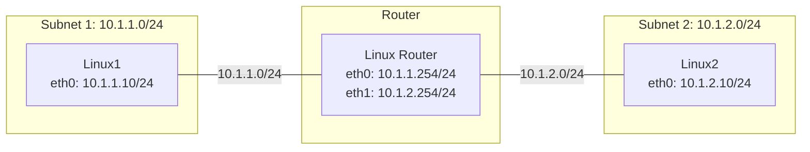
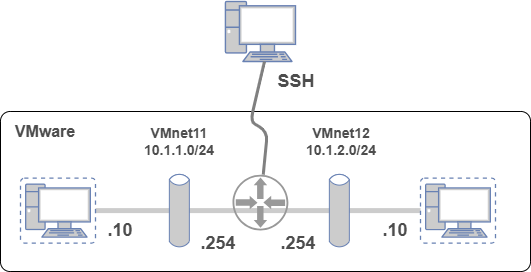

Linux 間の単純なルーティング構成
===

## 準備するもの

### 実行環境

実機は用意が大変なので仮想マシンで実行可能です。  
ここでは下記の環境で動作確認を行っています。  
仮想マシンを動かす PC には、16 GB以上メモリがあると安心です。

| 項目     | 内容                                |
| :------- | :---------------------------------- |
| 仮想環境 | VMware Workstation Pro 25H2         |
| VM       | vCPU 1、メモリ 2GB、ストレージ 8 GB |
| OS       | Debian Linux 13 最小インストール    |

試していませんが、Oracle VirtualBox でも実行可能のはずです。

### Linux にインストールしておくもの

SSH サーバ／クライアントと ping が必要になります。  
sudo もあると便利です。  
Debian を最小インストールすると、sudo コマンドが無いので、su コマンドで root に昇格し下記のパッケージをインストールしておいてください。

```bash
apt update
apt install ssh inetutils-ping
# SSH の自動起動設定
systemctl enable ssh
systemctl start ssh

# 最小インストールの debian には sudo コマンドが無いので、
# インストールしておくと他の Linux 同じに使用できて便利です。
apt install sudo

# sudo グループに debian アカウントを追加します。
# debian アカウントはインストールした環境に合わせて適宜修正してください。
# sudo グループの設定は、再ログイン後に反映されます。
/sbin/usermod -aG sudo debian
```

### ネットワーク構成



**VMware の仮想ネットワーク構成**



---

## 構築手順

:::important
- インターフェース名 (`eth0`, `eth1`) は環境に合わせて適宜読み替えてください。
- 設定は永続化してないので、OS 再起動すると初期状態に戻ります。
:::

### 1. Linux Router の設定

ルーターとして機能させるノードで、IP アドレスの設定と IP フォワーディングの有効化を行います。

```bash
# IPv4のパケットフォワーディングを有効化
sudo sysctl -w net.ipv4.ip_forward=1

# インターフェースにIPアドレスを設定
sudo ip addr add 10.1.1.254/24 dev eth0
sudo ip addr add 10.1.2.254/24 dev eth1

# リンクをアップする
sudo ip link set eth0 up
sudo ip link set eth1 up
```

> **Note**: 再起動後もフォワーディングを有効にする場合は、`/etc/sysctl.conf` に `net.ipv4.ip_forward=1` を追記して保存します。

### 2. Linux1 の設定

subnet1 に所属するノードの設定です。IP アドレスの設定と、subnet2 宛てのスタティックルートを追加します。

```bash
# IPアドレスの設定とリンクアップ
sudo ip addr add 10.1.1.10/24 dev eth0
sudo ip link set eth0 up

# subnet2 (10.1.2.0/24) 宛てのスタティックルートをルーター (10.1.1.254) 経由で登録
sudo ip route add 10.1.2.0/24 via 10.1.1.254
```

### 3. Linux2 の設定

subnet2 に所属するノードの設定です。IP アドレスの設定と、subnet1 宛てのスタティックルートを追加します。

```bash
# IPアドレスの設定とリンクアップ
sudo ip addr add 10.1.2.10/24 dev eth0
sudo ip link set eth0 up

# subnet1 (10.1.1.0/24) 宛てのスタティックルートをルーター (10.1.2.254) 経由で登録
sudo ip route add 10.1.1.0/24 via 10.1.2.254
```

---

## 疎通確認

### ルーティングテーブルの確認

各ノードで正しくルートが登録されているか確認します。

```bash
# ルーティングテーブルの表示
ip route
```

**Linux1の期待される出力例:**

```text
10.1.1.0/24 dev eth0 proto kernel scope link src 10.1.1.10 
10.1.2.0/24 via 10.1.1.254 dev eth0 
```

### pingによる疎通確認

**Linux1 から Linux2 への通信確認:**

```bash
ping -c 4 10.1.2.10
```

**Linux2 から Linux1 への通信確認:**

```bash
ping -c 4 10.1.1.10
```

通信が成功すれば (パケットロスが0%であれば)、ルーティングが正しく機能しています。

### 疎通できなくなることの確認

Linux1 と Linux2 のルーティングテーブルから互いのネットワークへのルートを削除すると通信ができなくなります。

```bash
# Linux1 で実行
sudo ip route del 10.1.2.0/24
# Linux2 で実行
sudo ip route del 10.1.1.0/24
```

:::note ルーティングテーブル削除時の注意
ルータ役の Linux 経由で Linux1、Linux2 に SSH でログインしている場合で、リモートではなくローカルのネットワークへのルートを削除した場合、それ以降、SSH 経由での操作ができなくなるので注意が必要です。
:::
