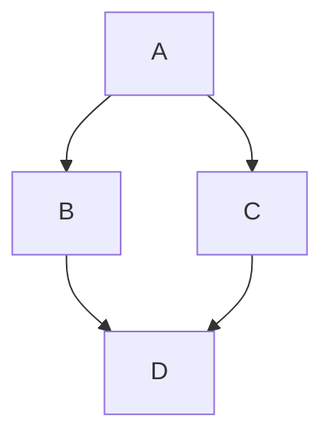

# ドキュメント作成ガイドライン

このプロジェクトにおける `docs/` および `draft/` 配下のドキュメント（Markdownファイル）の構成ルールと執筆に関するガイドラインです。

## 1. ファイル構成とメタデータ (Frontmatter)

すべてのドキュメントは、ファイルの先頭に以下の Frontmatter を含める必要があります。

```markdown
---
title: ドキュメントのタイトル
description: ドキュメントの簡潔な説明（1-2行）
#sidebar_position: 0
#id: home
#slug: /my-custom-url
---
```

- **title**: 必須。ブラウザのタブやサイドバーに表示されます。
- **description**: 必須。SEOやサイト内の説明文として利用されます。
- **sidebar_position**: 通常はコメントアウトした状態で保持します。
- **id / slug**: 必要に応じてコメント解除して使用しますが、基本はファイル名に基づいた自動生成を利用します。

## 2. 見出し構造

### タイトル (H1)
Frontmatterの直後に、H1見出しを配置します。このプロジェクトでは `#` 記法ではなく、**Setext形式（下線）** が推奨されています。

```markdown
ドキュメントのタイトル
===
```

### セクション (H2)
各セクションは `##` (Atx形式) を使用します。内容に応じて、以下の標準的なセクション名を使用してください。

- `## 概要`: ツールや設定の目的。
- `## インストール`: パッケージやツールの導入手順。
- `## 環境構築`: 設定ファイルの配置や初期設定。
- `## ファイル構成`: ディレクトリ構造やファイル一覧。
- `## 各種操作`: コマンドの実行例や操作方法。
- `## 使用例`: 具体的なユースケースや実行結果。
- `## 参考`: 公式ドキュメントや参考サイトのリンク。

## 3. コードブロック

コードブロックには、可能な限り `title` 属性を付与して、内容（ファイル名や実行場所）を明示してください。

- **ファイル内容の例**:
  ```markdown
  ```yaml title="docker-compose.yaml"
  services:
    ...
  ```
  ```

- **実行コマンドの例**:
  ```markdown
  ```bash title="PC 上で実行"
  npm start
  ```
  ```

### 対応言語
`bash`, `dockerfile`, `yaml`, `diff`, `config`, `text`, `ini`, `vim` など、適切なシンタックスハイライトを指定してください。

## 4. Docusaurus コンポーネント・特殊記法

### 折りたたみ (Details)
長い設定ファイルや補足的な手順は `<details>` と `<summary>` を使用して折りたたんでください。

```markdown
<details>
<summary>詳細な手順を表示</summary>

1. 手順A
2. 手順B

</details>
```

### アドモニション (Admonitions)
注意喚起や補足情報には、Docusaurus のアドモニション記法を使用します。

- `:::note`: 補足情報
- `:::tip`: 便利なヒント
- `:::info`: 情報
- `:::caution`: 注意
- `:::danger`: 警告

### 図解 (Mermaid)
ネットワーク構成やフロー図などは Mermaid を使用します。



---

## 5. 新規ドキュメント用テンプレート

新しいドキュメントを作成する際は、以下の内容をコピーして利用してください。

```markdown
---
title: タイトル
description: 説明
#sidebar_position: 0
---

タイトル
===

## 概要

## インストール

## 環境構築

## 各種操作

## 参考
```
