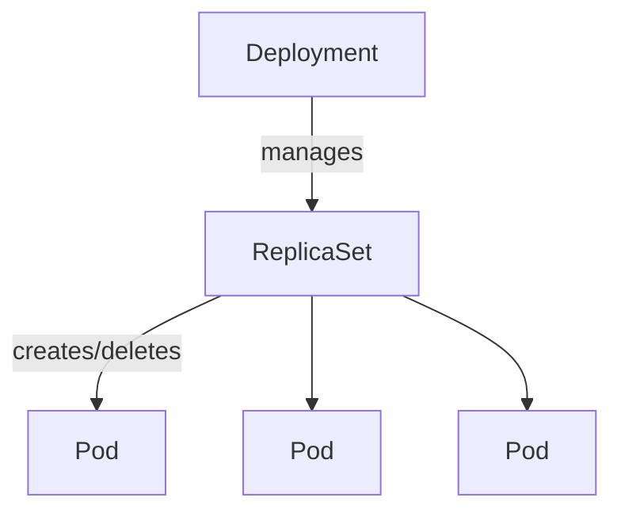
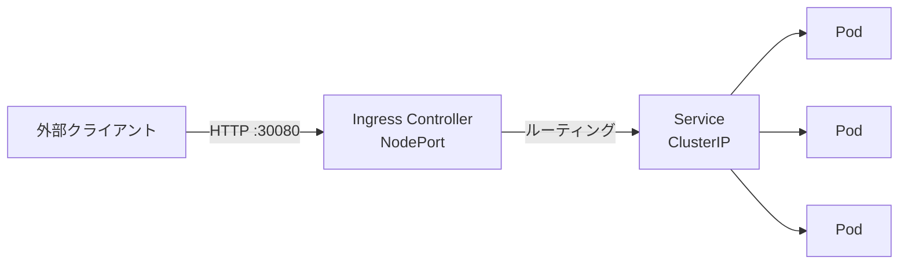
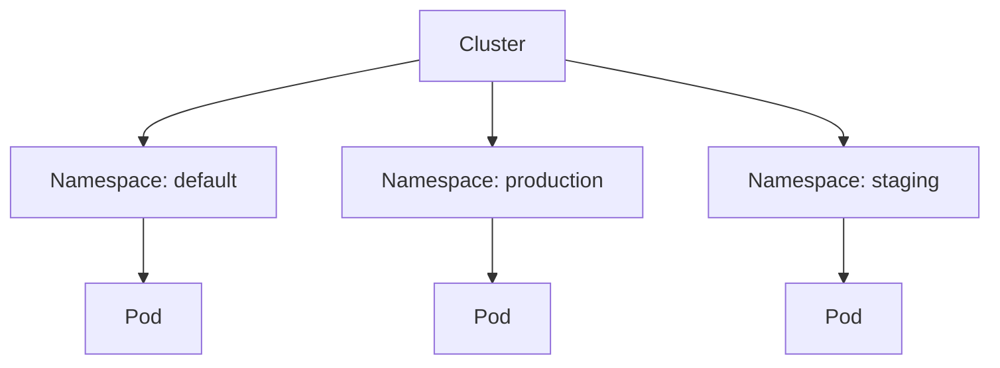

Kubernetes の基本操作
===

## Pod の基本操作

### Pod の実行

マニフェスト (YAML ファイル) を作成し `kubectl apply` で適用するのが基本的なワークフローです。

```bash
cat <<EOF > nginx-pod.yaml
apiVersion: v1
kind: Pod
metadata:
  name: nginx-pod-manifest
  labels:
    app: nginx
spec:
  containers:
  - name: nginx
    image: nginx:alpine
    ports:
    - containerPort: 80   # コンテナが Listen するポート
      hostPort: 8080      # ホストの 8080 番をコンテナの 80 番に転送（ブラウザから http://localhost:8080 でアクセス可能）
    resources:
      requests:
        memory: "64Mi"   # スケジューラがNode選択に使う最低保証量
        cpu: "250m"      # 1000m = 1vCPU
      limits:
        memory: "128Mi"  # 超過するとOOMKillされる上限量
        cpu: "500m"
    livenessProbe:        # 失敗するとコンテナを再起動
      httpGet:
        path: /
        port: 80
      initialDelaySeconds: 5   # 起動後この秒数待ってからプローブ開始
      periodSeconds: 10        # プローブの実行間隔（秒）
    readinessProbe:       # 失敗するとServiceのエンドポイントから除外
      httpGet:
        path: /
        port: 80
      initialDelaySeconds: 3
      periodSeconds: 5
EOF

kubectl apply -f nginx-pod.yaml
```

### Pod の状態確認とトラブルシューティング

#### Pod ステータスの種類

| ステータス | 説明 |
|---|---|
| `Pending` | スケジューリング待ち、またはコンテナイメージのダウンロード中 |
| `ContainerCreating` | コンテナの作成中（イメージ Pull 完了後） |
| `Running` | 少なくとも 1 つのコンテナが実行中 |
| `Succeeded` | 全コンテナが正常終了（Job などで使用） |
| `Failed` | 少なくとも 1 つのコンテナが異常終了 |
| `CrashLoopBackOff` | コンテナが繰り返しクラッシュしている（ログで原因を調査する） |
| `ImagePullBackOff` | コンテナイメージの取得に失敗（イメージ名やレジストリ認証を確認） |
| `Terminating` | 削除処理中 |

```bash
# Pod一覧の表示
kubectl get pods

# ノードのIPやPodのIPも含めた詳細一覧
kubectl get pods -o wide

# Pod状態の変化をリアルタイムで監視 (Pending→ContainerCreating→Running を観察)
kubectl get pods --watch

# 詳細情報の確認（Events欄で障害原因を特定する際に必須）
kubectl describe pod nginx-pod-manifest

# クラスタ全体のイベントを時系列で確認
kubectl get events --sort-by='.lastTimestamp'

# ログの表示
kubectl logs nginx-pod-manifest

# ログをリアルタイムで追跡する（tail -f 相当）
kubectl logs -f nginx-pod-manifest

# 直前にクラッシュしたコンテナのログを確認する（CrashLoopBackOff 時に有効）
kubectl logs --previous nginx-pod-manifest

# Pod 内に複数コンテナがある場合はコンテナ名を指定する
kubectl logs nginx-pod-manifest -c nginx

# Pod内でのコマンド実行
kubectl exec -it nginx-pod-manifest -- sh

# ⚠️ 単体Podには「停止」コマンドは存在しない。削除のみ可能。
# 「停止して再開したい」場合はDeploymentを使い、以下でレプリカ数を0にする（別セクション参照）
# kubectl scale deployment <deployment名> --replicas=0

# Podを削除する（マニフェストから起動した場合）
kubectl delete -f nginx-pod.yaml

# Pod名を指定して削除する
kubectl delete pod nginx-pod-manifest
```

---

## Deployment によるワークロード管理

Deployment は ReplicaSet を介して Pod のレプリカ数やアップデートを管理します。  
単体 Pod と異なり、**Pod が削除・クラッシュしても自動で再作成される**のが大きな利点です。



### Deployment の作成とスケーリング

```bash
cat <<EOF > deployment.yaml
apiVersion: apps/v1
kind: Deployment
metadata:
  name: web-deploy
spec:
  replicas: 3
  selector:
    matchLabels:
      app: web
  template:
    metadata:
      labels:
        app: web
    spec:
      containers:
      - name: nginx
        image: nginx:1.25
        ports:
        - containerPort: 80
EOF

kubectl apply -f deployment.yaml

# Deployment → ReplicaSet → Pod の3層構造を確認
kubectl get deployment,replicaset,pod -l app=web

# レプリカ数の変更 (スケールアウト)
kubectl scale deployment web-deploy --replicas=5

# Deployment の概要を確認（READY列で稼働中のレプリカ数を確認）
kubectl get deployment web-deploy
```

この段階では Pod が3個、それぞれの Pod にコンテナが 1 個ずつ起動しますが、curl コマンドやブラウザで参照しても nginx に接続できません。

### ローリングアップデートとロールバック

`kubectl apply` でイメージを更新すると、Pod を1つずつ入れ替える**ローリングアップデート**が実行されます。  
切り替え中も旧 Pod が稼働し続けるため、ダウンタイムなしで更新できます。

```bash
# イメージバージョンを更新する
kubectl set image deployment/web-deploy nginx=nginx:1.26

# ロールアウトの進捗をリアルタイムで確認（完了まで待機）
kubectl rollout status deployment/web-deploy

# 更新履歴の確認（CHANGE-CAUSE を残すには --record オプションまたは annotation を使用）
kubectl rollout history deployment/web-deploy

# 直前のバージョンにロールバックする
kubectl rollout undo deployment/web-deploy

# 特定のリビジョンにロールバックする
kubectl rollout undo deployment/web-deploy --to-revision=1
```

:::tip ロールアウトの一時停止
問題が起きた際にロールアウトを途中で止めることができます。

```bash
# ロールアウトを一時停止
kubectl rollout pause deployment/web-deploy

# ロールアウトを再開
kubectl rollout resume deployment/web-deploy
```
:::

---

## Service によるネットワーク公開

Pod は再起動のたびに IP アドレスが変わるため、直接 IP でアクセスするのは現実的ではありません。  
**Service** はラベルで Pod を束ね、固定のエンドポイント（ClusterIP）とロードバランシングを提供します。

### Service タイプの比較

| タイプ | 概要 | 用途 |
|---|---|---|
| `ClusterIP`（デフォルト） | クラスタ内部からのみアクセス可能な仮想 IP を割り当てる | マイクロサービス間通信 |
| `NodePort` | 全 Worker ノードの指定ポート（30000〜32767）で外部公開する | 開発・検証環境 |
| `LoadBalancer` | クラウドプロバイダーの LB を自動プロビジョニングする | 本番環境（GKE/EKS/AKS など） |
| `ExternalName` | DNS の CNAME として外部サービス名を解決する | 外部 DB やサービスとの接続 |

### Service の作成

```yaml title="service.yaml"
apiVersion: v1
kind: Service
metadata:
  name: web-service
spec:
  type: NodePort # ★ここを環境に合わせて変える（上記参照）
  selector:
    app: web     # ★重要：「app=web」ラベルを持つ Pod を自動で束ねてロードバランスする
  ports:
    - protocol: TCP
      port: 80        # Service 自体が受けるポート（クラスタ内からこのポートでアクセス）
      targetPort: 80  # Pod（コンテナ）のポート
      # nodePort: 30080  # 省略するとランダム割り当て（30000-32767）
```

```bash
kubectl apply -f service.yaml
```

### Service の確認と削除

```bash
# Service 一覧の表示
kubectl get service
# NAME          TYPE       CLUSTER-IP       EXTERNAL-IP   PORT(S)        AGE
# web-service   NodePort   10.111.225.120   <none>        80:31313/TCP   11s

# 詳細情報の確認（エンドポイント（実際に紐付いている Pod の IP）を確認できる）
kubectl describe service web-service

# マニフェストを指定して削除
kubectl delete -f service.yaml

# 名前を指定して削除
kubectl delete service web-service
```

Worker ノード上で `localhost:31313` に curl すると nginx につながるものの、リモート PC からは参照できません。  
クラスタ外からアクセスするには、次の **Ingress** を導入します。

---

## Ingress によるルーティング

NodePort は各ノードのポートを直接開放するシンプルな方式ですが、  
**Ingress** を使うとパスベースルーティングや TLS 終端を一元管理できます。



### Ingress コントローラーのインストール

Ingress リソースを処理するコントローラー本体を先にインストールする必要があります。  
ここでは Bare Metal 環境向けに NGINX Ingress Controller を使います。

```bash
# NGINX Ingress Controller のインストール
kubectl apply \
    -f https://raw.githubusercontent.com/kubernetes/ingress-nginx/controller-v1.15.1/deploy/static/provider/baremetal/deploy.yaml

# NodePort を 30080 番に固定する
# 💡 成功しない場合: デフォルトの NodePort 範囲 (30000-32767) 外である可能性があります。
# その場合は 30080 等を使用するか、API Server の設定変更が必要です。
kubectl patch service ingress-nginx-controller -n ingress-nginx \
  --type='json' \
  -p='[{"op": "replace", "path": "/spec/ports/0/nodePort", "value": 30080}]'

# 起動確認 (Running になるまで待ちます)
kubectl get pods -n ingress-nginx
```

### Ingress の設定

```yaml title="ingress.yaml"
apiVersion: networking.k8s.io/v1
kind: Ingress
metadata:
  name: web-ingress
  annotations:
    # プレフィックスの書き換え設定（必要に応じて）
    nginx.ingress.kubernetes.io/rewrite-target: /
spec:
  ingressClassName: nginx # 使用する Ingress Controller の指定
  rules:
  - http:
      paths:
      - path: /
        pathType: Prefix
        backend:
          service:
            name: web-service # 転送先の Service 名
            port:
              number: 80      # Service が待ち受けているポート
```

```bash
kubectl apply -f ingress.yaml
```

### Ingress の確認と管理

Ingress Controller は、外部からのリクエストを NodePort 経由で受け取り、各 Service へ振り分けます。

```bash
# Ingress 一覧の表示
kubectl get ingress

# 詳細な設定内容とイベントの確認
kubectl describe ingress web-ingress

# 接続先ポートの確認
# Bare Metal 環境では ingress-nginx-controller Service に割り当てられた NodePort を使用する
kubectl get service -n ingress-nginx ingress-nginx-controller
# NAME                       TYPE       CLUSTER-IP      EXTERNAL-IP   PORT(S)                      AGE
# ingress-nginx-controller   NodePort   10.108.133.31   <none>        80:30080/TCP,443:30544/TCP    2m
# → http://<NodeのIPアドレス>:30080 でアクセス可能

# マニフェストを修正して再適用（更新）
kubectl apply -f ingress.yaml

# 削除
kubectl delete -f ingress.yaml
```

### ロードバランスの確認

各 Pod の `index.html` を書き換えて、リクエストが複数の Pod に分散されることを確認します。

```bash
# Pod 名を確認する
kubectl get pods -l app=web

# 各Podのindex.htmlを書き換えて識別できるようにする（Pod名は環境に合わせて変更してください）
kubectl exec -it web-deploy-57794f8f99-44db8 \
    -- bash -c "echo \"server1\" > /usr/share/nginx/html/index.html"
kubectl exec -it web-deploy-57794f8f99-vp2t7 \
    -- bash -c "echo \"server2\" > /usr/share/nginx/html/index.html"
kubectl exec -it web-deploy-57794f8f99-ws2dd \
    -- bash -c "echo \"server3\" > /usr/share/nginx/html/index.html"

# 複数回リクエストを送り、異なるPodに振り分けられることを確認する
for i in $(seq 1 9); do curl -s http://localhost:30080; done
# server1
# server3
# server2
# server1
# ... のようにランダムに分散される
```

### NodePort 範囲の変更（30080 → 80）

Kubernetes ではデフォルトで「30000〜32767」の範囲のポートが設定され、この範囲外のポートを設定しようとするとエラーになります。  
この制限は Kubernetes の設定で変更できます。

- `/etc/kubernetes/manifests/kube-apiserver.yaml` の変更

    ```diff title="/etc/kubernetes/manifests/kube-apiserver.yaml"
         - --service-cluster-ip-range=10.96.0.0/12
         - --tls-cert-file=/etc/kubernetes/pki/apiserver.crt
         - --tls-private-key-file=/etc/kubernetes/pki/apiserver.key
    +    - --service-node-port-range=80-32767
         image: registry.k8s.io/kube-apiserver:v1.36.1
         imagePullPolicy: IfNotPresent
         livenessProbe:
    ```

    設定ファイルを保存すると Kubernetes は自動で再読み込み (もしかしたら再起動) します。

- Ingress の待受けポートを 80 番に変更する

    ```bash
    kubectl patch service ingress-nginx-controller -n ingress-nginx \
        --type='json' \
        -p='[{"op": "replace", "path": "/spec/ports/0/nodePort", "value": 80}]'

    # 変更確認
    kubectl get service -n ingress-nginx ingress-nginx-controller
    ```

---

## Namespace による論理的な分離

Namespace はクラスタ内をチーム・環境・用途ごとに**論理的に分割する**仕組みです。  
リソース名の衝突を避けたり、権限や ResourceQuota を Namespace 単位で管理するために使います。



### Namespace の基本操作

```bash
# Namespace 一覧の表示
kubectl get namespaces
# NAME              STATUS   AGE
# default           Active   10d  ← 指定なしはここに作成される
# kube-system       Active   10d  ← Kubernetes システムコンポーネント
# kube-public       Active   10d  ← 全ユーザーが読み取り可能
# ingress-nginx     Active   1d

# Namespace を作成する
kubectl create namespace staging

# 特定の Namespace のリソースを表示する
kubectl get pods -n staging

# 全 Namespace のリソースをまとめて表示する
kubectl get pods --all-namespaces
# または短縮形
kubectl get pods -A

# Namespace を指定してリソースを作成する
kubectl apply -f deployment.yaml -n staging

# デフォルト Namespace を変更する（毎回 -n を書く手間を省く）
kubectl config set-context --current --namespace=staging

# 現在の Namespace を確認する
kubectl config view --minify | grep namespace

# Namespace の削除（中のリソースもすべて削除される）
kubectl delete namespace staging
```
