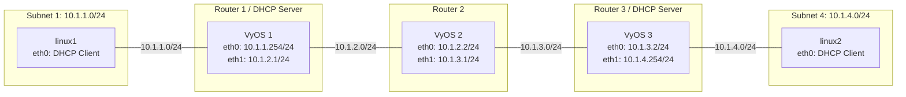

OSPF の設定例
===

## 準備するもの

### 実行環境

| 項目     | 内容                                |
| :------- | :---------------------------------- |
| 仮想環境 | VMware Workstation Pro 25H2         |
| VM       | vCPU 1、メモリ 2GB、ストレージ 8 GB |
| OS       | ルータ (3台)：vyos-2026.06.20-0050-rolling-generic-amd64<br />その他 (2台)：Debian Linux 13 最小インストール |

### Linux にインストールしておくもの

SSH サーバ／クライアントと ping が必要になります。  
sudo もあると便利です。  
Debian を最小インストールすると、sudo コマンドが無いので、su コマンドで root に昇格し下記のパッケージをインストールしておいてください。

```bash
apt update
apt install ssh inetutils-ping
# SSH の自動起動設定
systemctl enable ssh
systemctl start ssh

# 最小インストールの debian には sudo コマンドが無いので、
# インストールしておくと他の Linux 同じに使用できて便利です。
apt install sudo

# sudo グループに debian アカウントを追加します。
# debian アカウントはインストールした環境に合わせて適宜修正してください。
# sudo グループの設定は、再ログイン後に反映されます。
/sbin/usermod -aG sudo debian
```

---

## 構成図




## 構築手順

### 1. VyOS 1 の設定 (インターフェース、OSPF、DHCP)

VyOS 1 にIPアドレスを設定し、OSPFルーティングを有効化します。また、subnet1向けのDHCPサーバー機能を有効化し、PC1にIPアドレスとデフォルトルートを配布します。

```text
# 設定モードに入る
configure

# インターフェースにIPアドレスを設定
set interfaces ethernet eth0 address '10.1.1.254/24'
set interfaces ethernet eth1 address '10.1.2.1/24'

# subnet1向けのDHCPサーバー設定
set service dhcp-server shared-network-name SUBNET1 subnet 10.1.1.0/24 subnet-id 1
set service dhcp-server shared-network-name SUBNET1 subnet 10.1.1.0/24 range 0 start 10.1.1.100
set service dhcp-server shared-network-name SUBNET1 subnet 10.1.1.0/24 range 0 stop 10.1.1.200
set service dhcp-server shared-network-name SUBNET1 subnet 10.1.1.0/24 option default-router 10.1.1.254

# OSPFの設定 (エリア 0)
set protocols ospf area 0 network 10.1.1.0/24
set protocols ospf area 0 network 10.1.2.0/24

# 設定を適用して保存
commit
save
exit
```

### 2. VyOS 2 の設定 (インターフェース、OSPF)

VyOS 2 にIPアドレスを設定し、OSPFルーティングを有効化します。

```text
configure

# インターフェースにIPアドレスを設定
set interfaces ethernet eth0 address '10.1.2.2/24'
set interfaces ethernet eth1 address '10.1.3.1/24'

# OSPFの設定 (エリア 0)
set protocols ospf area 0 network 10.1.2.0/24
set protocols ospf area 0 network 10.1.3.0/24

commit
save
exit
```

### 3. VyOS 3 の設定 (インターフェース、OSPF、DHCP)

VyOS 3 にIPアドレスを設定し、OSPFルーティングを有効化します。また、subnet4向けのDHCPサーバー機能を有効化し、PC2にIPアドレスとデフォルトルートを配布します。

```text
configure

# インターフェースにIPアドレスを設定
set interfaces ethernet eth0 address '10.1.3.2/24'
set interfaces ethernet eth1 address '10.1.4.254/24'

# subnet4向けのDHCPサーバー設定
set service dhcp-server shared-network-name SUBNET4 subnet 10.1.4.0/24 subnet-id 4
set service dhcp-server shared-network-name SUBNET4 subnet 10.1.4.0/24 range 0 start 10.1.4.100
set service dhcp-server shared-network-name SUBNET4 subnet 10.1.4.0/24 range 0 stop 10.1.4.200
set service dhcp-server shared-network-name SUBNET4 subnet 10.1.4.0/24 option default-router 10.1.4.254

# OSPFの設定 (エリア 0)
set protocols ospf area 0 network 10.1.3.0/24
set protocols ospf area 0 network 10.1.4.0/24

commit
save
exit
```

### 4. linux1 の設定 (DHCPの取得)

subnet1に所属するDebian LinuxでDHCPクライアントを実行し、IPアドレスとルート情報を取得します。

```bash
# インターフェースを起動
sudo ip link set eth0 up

# DHCPでIPアドレスとルート情報を取得
sudo dhcpcd eth0
```

### 5. linux2 の設定 (DHCPの取得)

subnet4に所属するDebian Linuxでも同様にDHCPクライアントを実行します。

```bash
# インターフェースを起動
sudo ip link set eth0 up

# DHCPでIPアドレスとルート情報を取得
sudo dhcpcd eth0
```

---

## 疎通確認手順

### ルーティングテーブルの確認

各ルーターでOSPFによるルーティング情報が交換されていることを確認します。

**VyOS 1 のルーティングテーブル確認:**
```text
show ip route
```
`O` (OSPF) として `10.1.3.0/24` や `10.1.4.0/24` などの経路が見えていれば成功です。

OSPFのネイバー（隣接関係）が正常に確立されているかも確認できます。
```text
show ip ospf neighbor
```

### IPアドレスとPCのルーティングテーブルの確認

各Linuxノードで、DHCPから正しくIPアドレスとデフォルトルートが割り当てられているか確認します。

```bash
# 割り当てられたIPアドレスの確認 (例としてlinux1では 10.1.1.100 等になります)
ip addr show dev eth0

# ルーティングテーブルの確認
ip route
```

**linux1の期待されるルーティングテーブル出力例:**
```text
default via 10.1.1.254 dev eth0 proto dhcp src 10.1.1.100 metric 100 
10.1.1.0/24 dev eth0 proto kernel scope link src 10.1.1.100 
```
デフォルトルートがVyOS1（`10.1.1.254`）に向けられており、DHCPによって設定されていることがわかります。

### pingによる疎通確認

確認したIPアドレスを用いて、互いにpingで疎通確認を行います。
（※ここでは、DHCPにより `linux1` が `10.1.1.100`、`linux2` が `10.1.4.100` を取得したと仮定します）

**linux1 から linux2 への通信確認:**
```bash
ping -c 4 10.1.4.100
```

**linux2 から linux1 への通信確認:**
```bash
ping -c 4 10.1.1.100
```
