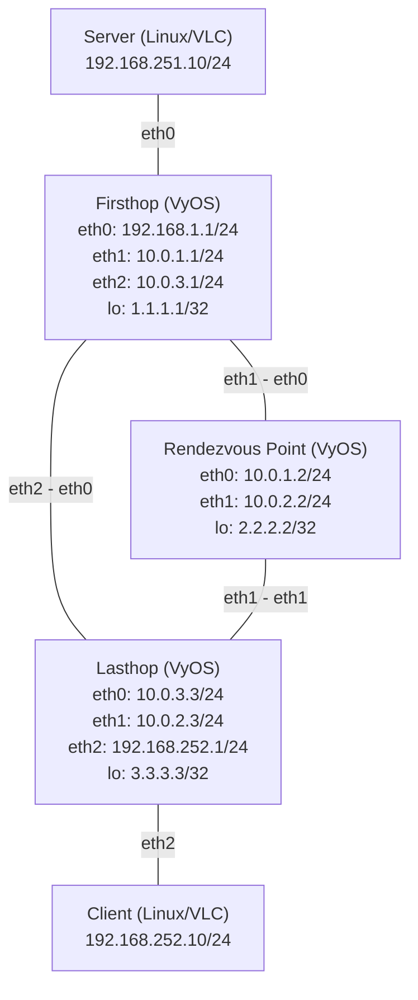

PIM-SMのマルチキャスト設定例
===

:::warning
この手順、VMware でやっているせいか、Firsthop、RP までは意図したマルチキャストルートが作成されますが、Lasthop の中継が解決できていません。  
RP 方向に (S,G)Prune は送信されているっぽい表示にはなるのですが、Lasthop に (S,G) ができない。
:::

## 構成図



---

## ステップ1：OSPFの設定と疎通確認

各VyOSルーター（Firsthop、RP、Lasthop）でインターフェースとOSPFの設定を行い、ユニキャストルーティングの疎通確認を行います。

### Firsthop ルーター

```bash
# インターフェース設定
set interfaces ethernet eth0 address '192.168.251.1/24'
set interfaces ethernet eth1 address '10.0.1.1/24'
set interfaces ethernet eth2 address '10.0.3.1/24'
set interfaces loopback lo address '1.1.1.1/32'

# OSPF設定
set protocols ospf area 0 network '192.168.251.0/24'
set protocols ospf area 0 network '10.0.1.0/24'
set protocols ospf area 0 network '10.0.3.0/24'
set protocols ospf area 0 network '1.1.1.1/32'
set protocols ospf parameters router-id '1.1.1.1'
```

### Rendezvous Point (RP) ルーター

```bash
# インターフェース設定
set interfaces ethernet eth0 address '10.0.1.2/24'
set interfaces ethernet eth1 address '10.0.2.2/24'
set interfaces loopback lo address '2.2.2.2/32'

# OSPF設定
set protocols ospf area 0 network '10.0.1.0/24'
set protocols ospf area 0 network '10.0.2.0/24'
set protocols ospf area 0 network '2.2.2.2/32'
set protocols ospf parameters router-id '2.2.2.2'
```

### Lasthop ルーター

```bash
# インターフェース設定
set interfaces ethernet eth0 address '10.0.3.3/24'
set interfaces ethernet eth1 address '10.0.2.3/24'
set interfaces ethernet eth2 address '192.168.252.1/24'
set interfaces loopback lo address '3.3.3.3/32'

# OSPF設定
set protocols ospf area 0 network '10.0.2.0/24'
set protocols ospf area 0 network '10.0.3.0/24'
set protocols ospf area 0 network '192.168.252.0/24'
set protocols ospf area 0 network '3.3.3.3/32'
set protocols ospf parameters router-id '3.3.3.3'
```

### OSPFの疎通確認

設定後、各ルーター上でOSPFのネイバーが確立されていること、および経路情報を学習していることを確認します。

```bash
# OSPFネイバーの確認
show ip ospf neighbor

# OSPFで学習した経路の確認
show ip route ospf
```

また、FirsthopルーターからLasthopルーターのClient側ネットワーク（`192.168.2.1`）へPingが通ることを確認します。
```bash
ping 192.168.2.1
```

---

## ステップ2：マルチキャスト（PIM-SM）の設定追加

OSPFによるユニキャスト疎通が確認できたら、PIM-SMとIGMPの設定を追加してマルチキャストツリーを構築できるようにします。

### Firsthop ルーター

Serverからのマルチキャストパケットを受け取るため `eth0` でIGMPを有効化し、各インターフェースにPIM-SMを設定します。RPアドレスとして `2.2.2.2` を指定します。

```bash
# PIM-SM設定
set protocols pim interface eth0
set protocols pim interface eth1
set protocols pim interface eth2
set protocols pim rp address '2.2.2.2' group '224.0.0.0/4'
```

### Rendezvous Point (RP) ルーター

マルチキャストの起点となる設定を行います。

```bash
# PIM-SM設定
set protocols pim interface eth0
set protocols pim interface eth1
set protocols pim interface lo
set protocols pim rp address '2.2.2.2' group '224.0.0.0/4'
```

### Lasthop ルーター

ClientからのIGMP Join（参加要求）を受け取るため `eth2` でIGMPを有効化し、PIM-SMを設定します。

```bash
# PIM-SM設定
set protocols pim interface eth0
set protocols pim interface eth1
set protocols pim interface eth2
set protocols pim rp address '2.2.2.2' group '224.0.0.0/4'
# VMware Workstation で IGMPv3 で Querier になれない場合、IGMPv2 にすると直ることがある 
set protocols pim interface eth2 igmp version 2
```

### PIMのステータス確認

設定後、PIMネイバーが確立しているか確認します。
```bash
show ip pim neighbor
```

## ステップ3：動作確認（VLCを用いたマルチキャスト送受信）

Linux環境のServerとClientでVLCメディアプレーヤーを利用し、実際の動画データでマルチキャスト配信・受信の動作確認を行います。
マルチキャストグループアドレスは `225.1.1.1`、ポート番号は `1234` とします。

### 1. Server（送信側）の準備

マルチキャストパケットが正しいインターフェース（ここでは`eth0`）から送信されるように、ルーティングを追加してから配信を開始します。
適当な動画ファイル（例：`sample.mp4`）を用意し、コマンドライン版VLC（`cvlc`）でストリーミングします。

```bash
# マルチキャスト宛のルーティングを追加
sudo ip route add 224.0.0.0/4 dev eth0

# VLCでマルチキャストストリーミング開始 (UDPでループ再生)
cvlc sample.mp4 --sout '#standard{access=udp,mux=ts,dst=225.1.1.1:1234}' --loop
```

### 2. Client（受信側）の準備

Client側でマルチキャストグループへの参加（IGMP Join）を行い、動画を受信・再生します。

```bash
# IGMP Joinを正しいインターフェースから送るためのルーティングを追加
sudo ip route add 224.0.0.0/4 dev eth0

# VLCでマルチキャストストリームを受信・再生
vlc udp://@225.1.1.1:1234
```

### 3. マルチキャストルーティングの確認 (VyOS)

ストリーミングと受信が開始されると、VyOSルーター上にマルチキャストルーティングテーブル (mroute) が生成されます。
特に RP および Lasthopルーターで以下のコマンドを実行し、エントリを確認してください。

```bash
# マルチキャストルーティングテーブルの確認
show ip multicast route
```
* **Lasthopルーター**: 共有ツリー `(*, G)` エントリが生成され、ClientからのIGMP Joinが認識されていること。
* **RPルーター**: 送信元ツリー `(S, G)` エントリが生成され、ServerからのストリームがRPに到達していること。
* その後、ツリーが最適化され、FirsthopからLasthopへの最短パス（SPT）で配信が行われていることを確認できます。
