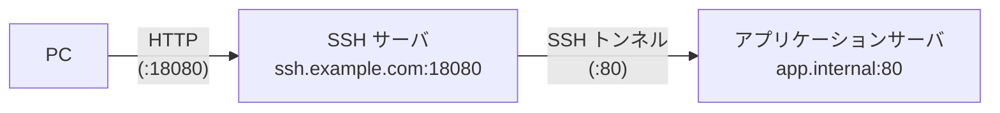

SSH ポートフォワーディング
===

## 概要

SSH 接続を「暗号化されたトンネル」として利用し、本来は直接アクセスできないネットワーク上のポート（サービス）へ通信を通す技術です。
踏み台となる SSH サーバを経由することで、ファイアウォールで遮断されている内部セグメントの DB や Web サーバ等に安全にアクセスできます。

主要な2つの接続パターン

1. ローカルポートフォワーディング (-L)

    <details>
    「自分の PC のポート」を入り口にする方法です。

    - 仕組み

        自分の PC（ローカル）の特定のポートに送った通信を、SSH トンネルを通じて「リモートネットワーク上の目的地」へ転送します。

    - 用途
    
        自宅から会社にある開発用 DB サーバに接続したい場合などに使われます。
    </details>

2. リモートポートフォワーディング (-R)

    <details>
    「SSHサーバ側のポート」を入り口にする方法です。

    - 仕組み

        SSH サーバ側で待機しているポートへのアクセスを、SSH トンネルを「逆流」させて、自分の PC 側（または自分の PC から見えるサービス）へ転送します。

    - 用途
    
        外部（インターネット）から、プライベートネットワーク内にある自分の PC へ一時的にアクセスさせたい場合などに使われます。
    </details>


## SSH ポートフォワーディングの設定確認

SSH サーバのポートフォワーディング設定は下記で確認できます。

```bash title="SSH ポートフォワーディング設定確認"
grep -E "AllowTcpForwarding|GatewayPorts" /etc/ssh/sshd_config
```

**AllowTcpForwarding yes** であればポートフォワーディングは有効です。

---

## 実行例

### ローカルポートフォワーディング


PC のローカルポート（ここでは **18080**）を、SSH サーバ経由でアプリケーションサーバのポート（ここでは **80**）に転送します。

```bash
ssh -L 18080:app.internal:80 user@ssh.example.com
```

| オプション                 | 説明                                                         |
| -------------------------- | ------------------------------------------------------------ |
| -L 18080:app.internal:8080 | localhost:18080 を SSH サーバ経由で app.internal:8080 に転送 |
| user@ssh.example.com       | 踏み台となる SSH サーバのユーザ・ホスト名                    |

コマンド実行後、PC のブラウザやコマンドから http://localhost:18080 にアクセスすることで、アプリケーションサーバのアプリを利用できます。


#### バックグラウンドで実行する場合

SSH セッションを維持しつつ、バックグラウンドでトンネルを張ることができます。

```bash
ssh -fNL 18080:app.internal:80 user@ssh.example.com
```

| オプション | 説明                                         |
| ---------- | -------------------------------------------- |
| -f         | バックグラウンドで実行                       |
| -N         | リモートコマンドを実行しない（トンネル専用） |


### リモートポートフォワーディング

SSH サーバ上の 18080 番ポートをアプリケーションサーバの 80 番ポートに転送するよう設定します。  
これにより、利用者は SSH サーバの 18080 番ポートにアクセスするだけで、リモートネットワーク上のターゲットのアプリケーションを利用できます。



```bash title="SSH サーバ上でのコマンド実行例"
ssh -fNL 0.0.0.0:18080:localhost:80 appuser@app.internal
```

| オプション           | 説明                                                        |
| -------------------- | ----------------------------------------------------------- |
| -fN                  | バックグラウンドで実行、リモートコマンドなし                |
| 0.0.0.0:18080        | SSH サーバ上の全インターフェースの 18080 番ポートで待ち受け |
| localhost:80         | トンネル先（app.internal から見た localhost:80）            |
| appuser@app.internal | アプリケーションサーバへの SSH 接続先                       |

:::note
**0.0.0.0** を指定することで SSH サーバの全インターフェースで待ち受けます。  
**127.0.0.1** にすると SSH サーバのローカルホストのみになります。
:::

PC からは SSH サーバのポートに直接アクセスできます。

```bash
curl http://ssh.example.com:18080
```


## バックグラウンドで実行したトンネルの確認・終了

### トンネルの確認

```bash title="SSH サーバ上で実行"
# トンネルのプロセス確認
ps aux | grep "ssh -fNL"

# ポートのリッスン確認
ss -tlnp | grep 18080
```

### トンネルの終了

```bash title="SSH サーバ上で実行"
kill $(pgrep -f "ssh -fNL")
```

#### SSH サーバからアプリへの疎通確認

SSH サーバからアプリケーションサーバへ接続が可能かどうかは、下記の方法で確認します。

```bash title="SSH サーバ上で実行"
# ポートの疎通確認
nc -zv app.internal 80

# HTTP レスポンス確認
curl -v http://app.internal
```

- nc コマンドは、指定された IP:port への接続性を確認するツールで、netcat-openbsd (apt)、nmap-ncat (dnf) でインストールできます。 


### $HOME/.ssh/config で設定する方法

**$HOME/.ssh/config** にポートフォワーディングパラメータを設定しておくことで、ポートフォワーディング実行時のオプション入力を省略できます。

```config title="PC上の $HOME/.ssh/config"
Host ssh-tunnel-app
    HostName ssh.example.com
    User user
    IdentityFile ~/.ssh/id_ed25519
    LocalForward 18080 app.internal:80
```

```bash title="PC 上で実行"
ssh ssh-tunnel-app
```
