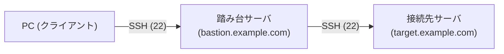

SSH ProxyJump / ProxyCommand
===

## SSH Proxy の特徴

SSH Proxy は、踏み台サーバ（プロキシサーバ）を経由して接続先サーバへ SSH 接続する仕組みです。  
クライアントは踏み台サーバを中継点として利用し、直接到達できないネットワーク上のサーバへ透過的にアクセスできます。

主な特徴
- セキュリティ向上 — 接続先サーバをインターネットに直接公開せず、踏み台サーバ経由のみでアクセスを制限できる
- 透過的な接続 — クライアントから見ると踏み台サーバを意識せず、接続先サーバに直接 SSH しているように操作できる
- 多段接続 — 踏み台サーバを複数経由する多段構成も設定ファイルで柔軟に組める
- SSH 機能との併用 — ポートフォワードや SCP など、SSH の各機能も踏み台経由でそのまま利用できる
- 認証の一元管理 — 踏み台サーバを認証の入口とすることで、アクセス制御を一か所に集約できる

## 構成図



## ProxyCommand を使う方法

OpenSSH 7.2 以前で利用できる古い記法です。

```bash title="ProxyCommand でのSSH接続"
ssh -o ProxyCommand="ssh -W %h:%p user@bastion.example.com" user@target.example.com
```

## ProxyJump を使う方法

OpenSSH 7.3 以降で利用できる、よりシンプルな記法です。

```bash title="ProxyJump でのSSH接続"
ssh -J user@bastion.example.com user@target.example.com
```

複数の踏み台を経由する場合はカンマ区切りで指定できます。

```bash title="複数の踏み台を経由する場合"
ssh -J user@bastion1.example.com,user@bastion2.example.com user@target.example.com
```

## $HOME/.ssh/config を使う方法

$HOME/.ssh/config に設定を記述することでコマンドを簡略化できます。

```config title="$HOME/.ssh/config"
# 踏み台サーバ
Host bastion
    HostName bastion.example.com
    User user
    IdentityFile ~/.ssh/id_ed25519

# 接続先サーバ（ProxyJump を使用）
Host target
    HostName target.example.com
    User user
    IdentityFile ~/.ssh/id_ed25519
    ProxyJump bastion
```

設定後は以下のコマンドで接続できます。

```bash title="config を使った接続"
ssh target
```
