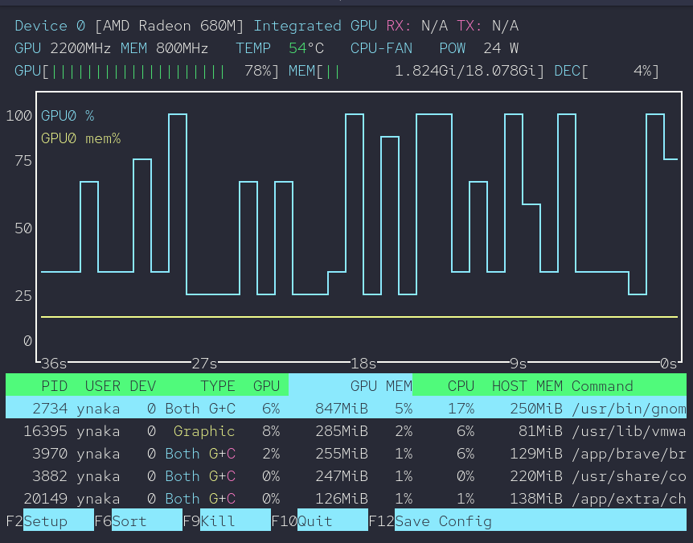

GPUモニタリングツール
===

---

## AMD Radeon

1. ROCm リポジトリの登録

    ```bash
    sudo tee /etc/yum.repos.d/rocm.repo << 'EOF'
    [ROCm]
    name=ROCm
    baseurl=https://repo.radeon.com/rocm/el$releasever/latest/main
    enabled=1
    priority=50
    gpgcheck=1
    gpgkey=https://repo.radeon.com/rocm/rocm.gpg.key
    EOF
    ```

2. パッケージキャッシュの更新

    ```bash
    sudo dnf clean all && sudo dnf makecache
    ```

3. rocm-smi-lib のインストール

    ```bash
    sudo dnf install -y rocm-smi-lib
    ```

4. rocm-smi の実行

    ```bash
    rocm-smi
    ```

    ```text
    WARNING: AMD GPU device(s) is/are in a low-power state. Check power control/runtime_status

    Exception caught: map::at
    ========================================= ROCm System Management Interface =========================================
    =================================================== Concise Info ===================================================
    Device  Node  IDs              Temp    Power     Partitions          SCLK  MCLK    Fan  Perf  PwrCap  VRAM%  GPU%  
                (DID,     GUID)  (Edge)  (Socket)  (Mem, Compute, ID)                                                
    ====================================================================================================================
    0       1     0x1681,   58561  55.0°C  31.061W   N/A, N/A, 0         N/A   800Mhz  0%   auto  N/A     32%    7%    
    ====================================================================================================================
    =============================================== End of ROCm SMI Log ================================================
    ```

---

## AMD Radeon / nVidia 共通

### インストール

- Debian / Ubuntu

    ```bash
    sudo apt install -y nvtop
    ```

- RHEL / Alma / Rocky 等

    ```bash
    # EPEL リポジトリを有効化
    sudo dnf install -y epel-release
    # nvtop インストール
    sudo dnf install -y nvtop
    ```

### 実行

```bash
nvtop
```


