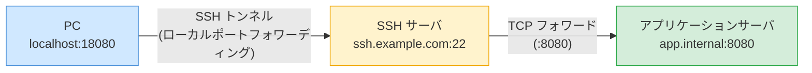
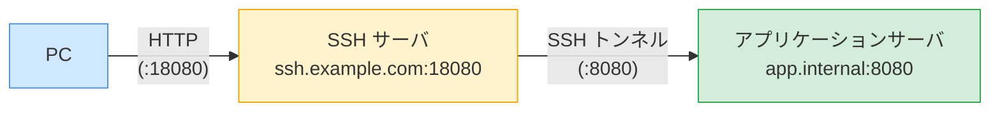

SSH ポートフォワーディング
===

SSH のポートフォワーディング機能を使い、PC から SSH サーバ経由でアプリケーションサーバ上のアプリ（HTTP など）に接続します。


## コマンド実行例

### ローカルポートフォワーディング



PC のローカルポート（例: `18080`）を、SSH サーバ経由でアプリケーションサーバのポート（例: `8080`）に転送します。

```bash title="PC 上で実行"
ssh -L 18080:app.internal:8080 user@ssh.example.com
```

| オプション                   | 説明                                                                   |
| ---------------------------- | ---------------------------------------------------------------------- |
| `-L 18080:app.internal:8080` | PC の `localhost:18080` を SSH サーバ経由で `app.internal:8080` に転送 |
| `user@ssh.example.com`       | 踏み台となる SSH サーバのユーザ・ホスト名                              |

コマンド実行後、PC のブラウザやコマンドから `http://localhost:18080` にアクセスすることで、アプリケーションサーバのアプリを利用できます。

```bash title="PC 上で接続確認"
curl http://localhost:18080
```

### バックグラウンドで実行する場合

SSH セッションを維持しつつ、バックグラウンドでトンネルを張ることができます。

```bash title="PC 上で実行（バックグラウンド）"
ssh -fNL 18080:app.internal:8080 user@ssh.example.com
```

| オプション | 説明                                         |
| ---------- | -------------------------------------------- |
| `-f`       | バックグラウンドで実行                       |
| `-N`       | リモートコマンドを実行しない（トンネル専用） |

## SSH サーバ側でポートフォワーディングする方法

SSH サーバ自身がアプリケーションサーバへの SSH トンネルを張り、SSH サーバの `18080` 番ポートをアプリの `8080` 番に転送します。
PC からは SSH サーバの `18080` 番ポートに直接アクセスするだけで済みます。



### SSH サーバ上でのコマンド実行例

```bash title="SSH サーバ上で実行"
ssh -fNL 0.0.0.0:18080:localhost:8080 appuser@app.internal
```

| オプション             | 説明                                                          |
| ---------------------- | ------------------------------------------------------------- |
| `-fN`                  | バックグラウンドで実行、リモートコマンドなし                  |
| `0.0.0.0:18080`        | SSH サーバ上の全インターフェースの `18080` 番ポートで待ち受け |
| `localhost:8080`       | トンネル先（`app.internal` から見た `localhost:8080`）        |
| `appuser@app.internal` | アプリケーションサーバへの SSH 接続先                         |

:::note
`0.0.0.0` を指定することで SSH サーバの全インターフェースで待ち受けます。`127.0.0.1` にすると SSH サーバのローカルホストのみになります。
:::

PC からは SSH サーバのポートに直接アクセスできます。

```bash title="PC 上で接続確認"
curl http://ssh.example.com:18080
```

### トンネルの確認・終了

```bash title="SSH サーバ上で実行"
# トンネルのプロセス確認
ps aux | grep "ssh -fNL"

# ポートのリッスン確認
ss -tlnp | grep 18080

# トンネルの終了
kill $(pgrep -f "ssh -fNL 0.0.0.0:18080")
```

## SSH サーバの設定確認

SSH サーバでポートフォワーディングが許可されているか確認します。

```bash title="SSH サーバ上で実行"
grep -E "AllowTcpForwarding|GatewayPorts" /etc/ssh/sshd_config
```

デフォルトでは `AllowTcpForwarding yes` になっています。明示的に無効化されている場合は有効にします。

```bash title="/etc/ssh/sshd_config"
AllowTcpForwarding yes
```

```bash title="SSH サーバ上で実行（設定反映）"
sudo systemctl restart sshd
```

### SSH サーバからアプリへの疎通確認

SSH サーバからアプリケーションサーバへの接続が可能かどうかを確認します。

```bash title="SSH サーバ上で実行"
# ポートの疎通確認
nc -zv app.internal 8080

# HTTP レスポンス確認
curl -v http://app.internal:8080
```

## ~/.ssh/config に設定する方法

`~/.ssh/config` に記述しておくことで、毎回オプションを入力する手間を省けます。

```config title="~/.ssh/config（PC 上）"
Host ssh-tunnel-app
    HostName ssh.example.com
    User user
    IdentityFile ~/.ssh/id_ed25519
    LocalForward 18080 app.internal:8080
```

```bash title="PC 上で実行"
ssh ssh-tunnel-app
```
