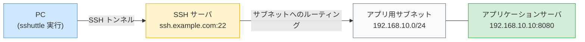

sshuttle（VPN over SSH）
===

`sshuttle` は SSH を使って特定のサブネット向けのトラフィックをトンネリングする VPN ライクなツールです。
個別にポートフォワーディングを設定することなく、サブネット全体への透過的なアクセスが可能になります。

## 構成図



## インストール

### Debian / Ubuntu

```bash
sudo apt install sshuttle
```

### Fedora / Alma Linux

```bash
sudo dnf install sshuttle
```

### macOS

```bash
brew install sshuttle
```

## コマンド実行例

### 特定サブネットへの接続

アプリケーションサーバが属するサブネット（例: `192.168.10.0/24`）のトラフィックを SSH サーバ経由でルーティングします。

```bash title="PC 上で実行"
sshuttle -r user@ssh.example.com 192.168.10.0/24
```

| オプション・引数 | 説明 |
|---|---|
| `-r user@ssh.example.com` | 踏み台となる SSH サーバのユーザ・ホスト名 |
| `192.168.10.0/24` | トンネル経由でルーティングするサブネット |

接続後、PC から直接アプリケーションサーバの IP・ポートにアクセスできます。

```bash title="PC 上で接続確認"
curl http://192.168.10.10:8080
```

### 複数のサブネットを指定する場合

```bash title="PC 上で実行"
sshuttle -r user@ssh.example.com 192.168.10.0/24 192.168.20.0/24
```

### すべてのトラフィックをトンネル経由にする場合

```bash title="PC 上で実行"
sshuttle -r user@ssh.example.com 0.0.0.0/0
```

:::caution
`0.0.0.0/0` を指定すると DNS を含むすべてのトラフィックがトンネル経由になります。
:::

### バックグラウンドで実行する場合

```bash title="PC 上で実行（バックグラウンド）"
sshuttle -r user@ssh.example.com 192.168.10.0/24 --daemon --pidfile=/tmp/sshuttle.pid
```

```bash title="切断する場合"
kill $(cat /tmp/sshuttle.pid)
```

### SSH 秘密鍵を指定する場合

```bash title="PC 上で実行"
sshuttle -r user@ssh.example.com 192.168.10.0/24 --ssh-cmd "ssh -i ~/.ssh/id_ed25519"
```

## SSH サーバの要件

SSH サーバ側には Python 3 がインストールされている必要があります。

```bash title="SSH サーバ上で確認"
python3 --version
```
