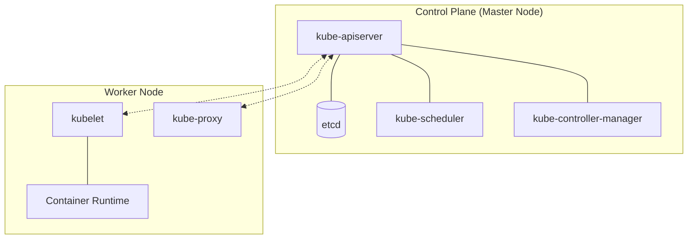

Kubernetesクラスタの構築
===

このフェーズでは、Debian/Fedora OS上に Kubernetes クラスタを構築します。

---

## アーキテクチャ図



---

## OS の初期設定と前提条件 (全ノードで実施)

### スワップの無効化

kubelet はノードのメモリリソースを確定的に管理するため、スワップが有効なノードへのデプロイをデフォルトで拒否します。

```bash
# 即時無効化
sudo swapoff -a

# 再起動後も無効化を維持 (fstabのswap行をコメントアウト)
sudo sed -i '/swap/s/^/#/' /etc/fstab

# 確認（何も表示されなければOK）
swapon --show
```

### ネットワーク設定 (カーネルモジュールと sysctl )

- カーネルモジュール

    ```bash
    # 必要なモジュールのロード
    cat <<EOF | sudo tee /etc/modules-load.d/k8s.conf
    overlay
    br_netfilter
    EOF

    sudo modprobe overlay
    sudo modprobe br_netfilter
    ```

    - **overlay** はコンテナのレイヤードファイルシステム (OverlayFS)
    - **br_netfilter** はブリッジ経由パケットを iptables でフィルタするためのモジュール

- カーネルパラメータ

    ```bash
    # sysctl パラメータの設定
    cat <<EOF | sudo tee /etc/sysctl.d/k8s.conf
    net.bridge.bridge-nf-call-iptables  = 1
    net.bridge.bridge-nf-call-ip6tables = 1
    net.ipv4.ip_forward                 = 1
    EOF

    # 設定の適用
    sudo sysctl --system
    ```

### SELinuxの設定 ( Fedora / RHEL 等)

```bash
# Permissiveモードへ変更（完全無効化より推奨）
sudo setenforce 0
sudo sed -i 's/^SELINUX=enforcing/SELINUX=permissive/' /etc/selinux/config
```

### ファイアウォールの設定

- Fedora / RHEL 等

    ```bash
    # Control Planeノード
    sudo firewall-cmd --permanent --add-port=6443/tcp        # kube-apiserver
    sudo firewall-cmd --permanent --add-port=2379-2380/tcp   # etcd
    sudo firewall-cmd --permanent --add-port=10250/tcp       # kubelet API
    sudo firewall-cmd --permanent --add-port=10257/tcp       # kube-controller-manager
    sudo firewall-cmd --permanent --add-port=10259/tcp       # kube-scheduler
    sudo firewall-cmd --reload

    # Worker Nodeノード
    sudo firewall-cmd --permanent --add-port=10250/tcp       # kubelet API
    sudo firewall-cmd --permanent --add-port=30000-32767/tcp # NodePort Services
    sudo firewall-cmd --reload
    ```

- ufw を使っている場合

    ```bash
    # Control Planeノード
    sudo ufw allow 6443/tcp        # kube-apiserver
    sudo ufw allow 2379:2380/tcp   # etcd
    sudo ufw allow 10250/tcp       # kubelet API
    sudo ufw allow 10257/tcp       # kube-controller-manager
    sudo ufw allow 10259/tcp       # kube-scheduler
    sudo ufw reload

    # Worker Nodeノード
    sudo ufw allow 10250/tcp       # kubelet API
    sudo ufw allow 30000:32767/tcp # NodePort Services
    sudo ufw reload
    ```

---

## コンテナランタイム (containerd) のインストール

Kubernetes は CRI (Container Runtime Interface) を通じてコンテナランタイムと通信します。  
この標準インターフェースにより **containerd** や **CRI-O** など異なるランタイムを差し替えられます。

### インストール

- Debian / Ubuntu

    ```bash
    sudo apt update
    sudo apt install -y ca-certificates curl gnupg
    sudo install -m 0755 -d /etc/apt/keyrings
    curl -fsSL https://download.docker.com/linux/debian/gpg \
        | sudo gpg --dearmor -o /etc/apt/keyrings/docker.gpg
    sudo chmod a+r /etc/apt/keyrings/docker.gpg

    echo \
        "deb [arch=$(dpkg --print-architecture) signed-by=/etc/apt/keyrings/docker.gpg] https://download.docker.com/linux/debian \
        $(. /etc/os-release && echo "$VERSION_CODENAME") stable" | \
        sudo tee /etc/apt/sources.list.d/docker.list > /dev/null

    sudo apt update
    sudo apt install -y containerd.io
    ```

- Fedora / RHEL 等

    ```bash
    sudo dnf -y install dnf-plugins-core
    sudo dnf config-manager \
        --add-repo https://download.docker.com/linux/fedora/docker-ce.repo
    sudo dnf install -y containerd.io
    ```

### containerd の設定 (SystemdCgroupの有効化)

kubelet と containerd の cgroup ドライバーを **systemd** で統一することで、リソース管理の競合を防ぎます。

```bash
sudo mkdir -p /etc/containerd
containerd config default \
    | sudo tee /etc/containerd/config.toml \
    > /dev/null
# SystemdCgroup = true に書き換え
sudo sed -i 's/SystemdCgroup = false/SystemdCgroup = true/g' /etc/containerd/config.toml

sudo systemctl restart containerd
sudo systemctl enable containerd

# 動作確認
sudo systemctl is-active containerd
```

---

## Kubernetesコンポーネントのインストール

:::tip バージョンについて
バージョン番号（`v1.32`）は受験時点の最新安定版を [Kubernetesリリースページ](https://kubernetes.io/releases/) で確認して変更してください。
:::

- Debian / Ubuntu

    ```bash
    sudo apt update
    sudo apt install -y apt-transport-https ca-certificates curl
    curl -fsSL https://pkgs.k8s.io/core:/stable:/v1.32/deb/Release.key \
        | sudo gpg --dearmor -o /etc/apt/keyrings/kubernetes-apt-keyring.gpg

    echo \
        'deb [signed-by=/etc/apt/keyrings/kubernetes-apt-keyring.gpg] https://pkgs.k8s.io/core:/stable:/v1.32/deb/ /' \
        | sudo tee /etc/apt/sources.list.d/kubernetes.list

    sudo apt update
    sudo apt install -y kubelet kubeadm kubectl
    sudo apt-mark hold kubelet kubeadm kubectl

    # kubeletの自動起動を有効化（kubeadm init前は起動に失敗するが有効化は先に実施する）
    sudo systemctl enable --now kubelet
    ```

- Fedora / RHEL 等

    ```bash
    cat <<EOF | sudo tee /etc/yum.repos.d/kubernetes.repo
    [kubernetes]
    name=Kubernetes
    baseurl=https://pkgs.k8s.io/core:/stable:/v1.32/rpm/
    enabled=1
    gpgcheck=1
    gpgkey=https://pkgs.k8s.io/core:/stable:/v1.32/rpm/repodata/repomd.xml.key
    exclude=kubelet kubeadm kubectl cri-tools kubernetes-cni
    EOF

    sudo dnf install -y kubelet kubeadm kubectl --disableexcludes=kubernetes

    # kubeletの自動起動を有効化
    sudo systemctl enable --now kubelet
    ```

---

## クラスタの初期化とネットワーク設定

### Control Planeの初期化 (Masterノードのみ)

```bash
# 10.254.0.0/16 はPodネットワーク用。CNI (Calico) と合わせる。
sudo kubeadm init --pod-network-cidr=10.254.0.0/16
```

### kubectl の設定 (Masterノードのみ)

```bash
mkdir -p $HOME/.kube
sudo cp -i /etc/kubernetes/admin.conf $HOME/.kube/config
sudo chown $(id -u):$(id -g) $HOME/.kube/config
```

### CNI (Calico) のインストール (Masterノードのみ)

CNI プラグインを適用するまで Pod はネットワーク設定が行われず、CoreDNSのPodが **Pending** のままになります。

```bash
kubectl create \
    -f https://raw.githubusercontent.com/projectcalico/calico/v3.27.0/manifests/tigera-operator.yaml

# custom-resources.yaml のデフォルトCIDR (192.168.0.0/16) を kubeadm init で指定した値に合わせて変更してから適用する
curl -fsSL https://raw.githubusercontent.com/projectcalico/calico/v3.27.0/manifests/custom-resources.yaml \
    | sed 's|192\.168\.0\.0/16|10.254.0.0/16|g' \
    | kubectl create -f -

# NodeがReadyになるまで待機（数分かかる場合あり）
kubectl get nodes --watch
```

### Worker Nodeの参加 ( Worker ノードのみ)

Masterノードの **kubeadm init** 実行時に表示された **kubeadm join** コマンドを Worker Node で実行します。

:::info シングルノード構成の場合
Control Plane と Worker Node を同居させる場合（後述）、**kubeadm join は実行しません。**  
**kubeadm join** を Control Plane と同じノードで実行すると、**kubelet.conf** や **pki/ca.crt** が既に存在するためエラーになります。
:::

```bash
# 例: sudo kubeadm join <Master-IP>:6443 --token <token> --discovery-token-ca-cert-hash sha256:<hash>
```

:::caution トークンの有効期限に注意
`kubeadm init` で発行されたトークンは **24時間で失効** します。  
期限切れの場合は Masterノードで以下を実行して新しいトークンを発行してください。

```bash
kubeadm token create --print-join-command
```
:::

### クラスタの状態確認

```bash
# 全ノードの状態確認（全て Ready になること）
kubectl get nodes -o wide

# システムPodの確認（全て Running になること）
kubectl get pods -n kube-system
```

---

## Control Plane と Worker Node の同居 (シングルノード構成)

:::warning 本番環境には非推奨
この設定は学習・検証目的の **シングルノード構成** 向けです。本番環境では Control Plane への一般 Pod のスケジューリングは推奨されません。
:::

Kubernetes はデフォルトで Control Plane ノードに **Taint** を付与し、一般の Pod がスケジュールされないようにしています。  
この Taint を除去することで、Control Plane ノードを Worker Node として兼用できます。

```bash
# Control Plane ノードの Taint を確認
kubectl describe node $(kubectl get nodes --selector='node-role.kubernetes.io/control-plane' -o jsonpath='{.items[0].metadata.name}') \
    | grep Taint

# Taint を除去（ノード名は環境に合わせて変更）
kubectl taint nodes --all node-role.kubernetes.io/control-plane-

# 除去後の確認（Taints: <none> となること）
kubectl describe node $(kubectl get nodes --selector='node-role.kubernetes.io/control-plane' -o jsonpath='{.items[0].metadata.name}') \
    | grep Taint
```

Taint を再設定して元に戻す場合は以下を実行します。

```bash
kubectl taint nodes <node-name> node-role.kubernetes.io/control-plane:NoSchedule
```

### 同居状態の確認

```bash
# ノードの ROLES 列に control-plane が表示され、かつノードが 1台のみであることを確認
kubectl get nodes

# 期待する出力例:
# NAME        STATUS   ROLES           AGE   VERSION
# k8s-node1   Ready    control-plane   10m   v1.32.x

# Taint が除去されていること（Taints: <none>）を確認
kubectl describe node $(kubectl get nodes -o jsonpath='{.items[0].metadata.name}') \
    | grep -E "Taints:|Roles:"

# 実際に Pod がこのノードにスケジュールされていることを確認
# （Calico や CoreDNS の Pod が Running になっていれば同居成功）
kubectl get pods -A -o wide | grep $(kubectl get nodes -o jsonpath='{.items[0].metadata.name}')
```

---

## 動作確認: 2048 コンテナの起動

クラスタが正常に動作しているか確認するため、ブラウザゲーム **2048** をコンテナで起動します。

### Deployment と Service の作成

```bash
# 2048 の Deployment を作成
kubectl create deployment game-2048 --image=public.ecr.aws/l6m2t8p7/docker-2048:latest

# NodePort Service で外部公開（ポート番号は自動割り当て）
kubectl expose deployment game-2048 --type=NodePort --port=80

# Pod が Running になるまで待機
kubectl get pods -l app=game-2048 --watch
```

### ブラウザでのアクセス

```bash
# 割り当てられた NodePort を確認
kubectl get service game-2048

# 期待する出力例:
# NAME        TYPE       CLUSTER-IP      EXTERNAL-IP   PORT(S)        AGE
# game-2048   NodePort   10.96.xxx.xxx   <none>        80:3xxxx/TCP   1m

# ノードの IP アドレスを確認
kubectl get nodes -o wide
```

上記で確認した **ノードの IP** と **NodePort** を使ってブラウザでアクセスします。

```
http://<ノードのIP>:<NodePort>
```

### 確認後のクリーンアップ

```bash
# Deployment の一覧確認
kubectl get deployments

# 特定の Deployment の詳細確認
kubectl describe deployment game-2048

# Service の一覧確認
kubectl get service

# Deployment と Service の削除
kubectl delete service game-2048
kubectl delete deployment game-2048

# 削除確認（表示されなければOK）
kubectl get deployments
kubectl get service
```
