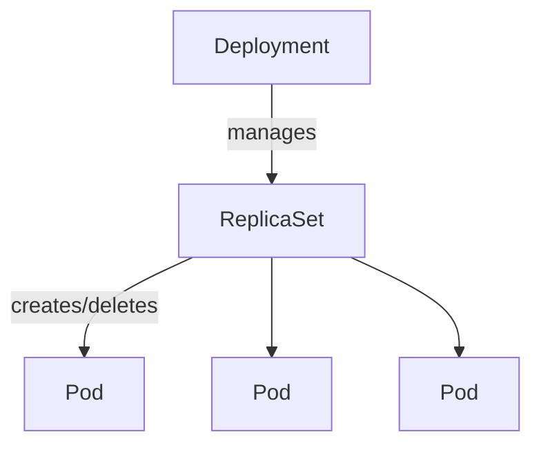

Kubernetesの基本リソース操作
===

このフェーズでは、Kubernetesの基本リソースを操作し、宣言的管理の仕組みを理解します。  
試験の配点が最も高い「Kubernetes基礎（44%）」と「コンテナオーケストレーション（28%）」に対応します。

## Pod の基本操作

### Pod の実行 (命令的 vs 宣言的)

```bash
# 命令的 (Imperative): コマンドで直接実行
kubectl run nginx-pod --image=nginx:alpine

# 宣言的 (Declarative): YAMLを定義して適用
cat <<EOF > pod.yaml
apiVersion: v1
kind: Pod
metadata:
  name: nginx-pod-manifest
  labels:
    app: nginx
spec:
  containers:
  - name: nginx
    image: nginx:alpine
    ports:
    - containerPort: 80
    resources:
      requests:
        memory: "64Mi"   # スケジューラがNode選択に使う最低保証量
        cpu: "250m"
      limits:
        memory: "128Mi"  # 超過するとOOMKillされる上限量
        cpu: "500m"
    livenessProbe:        # 失敗するとコンテナを再起動
      httpGet:
        path: /
        port: 80
      initialDelaySeconds: 5
      periodSeconds: 10
    readinessProbe:       # 失敗するとServiceのエンドポイントから除外
      httpGet:
        path: /
        port: 80
      initialDelaySeconds: 3
      periodSeconds: 5
EOF
kubectl apply -f pod.yaml
```

### Pod の状態確認とトラブルシューティング

```bash
# Pod一覧の表示
kubectl get pods

# Pod状態の変化をリアルタイムで監視 (Pending→ContainerCreating→Running を観察)
kubectl get pods --watch

# 詳細情報の確認（Events欄で障害原因を特定する際に必須）
kubectl describe pod nginx-pod-manifest

# クラスタ全体のイベントを時系列で確認
kubectl get events --sort-by='.lastTimestamp'

# ログの表示
kubectl logs nginx-pod-manifest

# Pod内でのコマンド実行
kubectl exec -it nginx-pod-manifest -- sh
```

---

## Deployment によるワークロード管理

Deployment は ReplicaSet を介して Pod のレプリカ数やアップデートを管理します。



### Deployment の作成とスケーリング

```bash
cat <<EOF > deployment.yaml
apiVersion: apps/v1
kind: Deployment
metadata:
  name: web-deploy
spec:
  replicas: 3
  selector:
    matchLabels:
      app: web
  template:
    metadata:
      labels:
        app: web
    spec:
      containers:
      - name: nginx
        image: nginx:1.25
        ports:
        - containerPort: 80
EOF
kubectl apply -f deployment.yaml

# Deployment → ReplicaSet → Pod の3層構造を確認
kubectl get deployment,replicaset,pod -l app=web

# レプリカ数の変更 (スケールアウト)
kubectl scale deployment web-deploy --replicas=5
```

### Self-healing の確認

Deployment が管理する Pod は、意図せず削除されても自動的に再作成されます。

```bash
# Podを1つ強制削除
kubectl delete pod $(kubectl get pod -l app=web -o name | head -1)

# 自動復旧の様子を監視 (READY数が一時的に減り、すぐに回復する)
kubectl get pods -l app=web --watch
```

### ローリングアップデートとロールバック

```bash
# イメージの更新 (v1.25 -> v1.26)
kubectl set image deployment/web-deploy nginx=nginx:1.26

# アップデート状況の確認
kubectl rollout status deployment/web-deploy

# 履歴の確認
kubectl rollout history deployment/web-deploy

# ロールバック (以前のバージョンに戻す)
kubectl rollout undo deployment/web-deploy
```

---

## 用途別ワークロードリソース

Deploymentの他にも、目的に応じた複数のワークロードリソースがあります。

### StatefulSet
Podに安定したネットワークID（hostname）と専用の永続ストレージを提供します。Pod名が `name-0`, `name-1` と順序付けられ、再作成後も同じ名前・PVCが紐付きます。MySQLやZooKeeperなどのステートフルなアプリケーションに使用します。

```bash
cat <<EOF > statefulset.yaml
apiVersion: apps/v1
kind: StatefulSet
metadata:
  name: web-sts
spec:
  serviceName: "web-sts-svc"   # Headless Serviceへの参照（DNS名の解決に使用）
  replicas: 3
  selector:
    matchLabels:
      app: web-sts
  template:
    metadata:
      labels:
        app: web-sts
    spec:
      containers:
      - name: nginx
        image: nginx:alpine
        volumeMounts:
        - name: data
          mountPath: /usr/share/nginx/html
  volumeClaimTemplates:         # Podごとに個別のPVCが自動作成される
  - metadata:
      name: data
    spec:
      accessModes: ["ReadWriteOnce"]
      resources:
        requests:
          storage: 100Mi
EOF
kubectl apply -f statefulset.yaml

# Pod名が web-sts-0, web-sts-1, web-sts-2 と順序付けられていることを確認
kubectl get pods -l app=web-sts

# 各Podに専用のPVCが自動作成されていることを確認
kubectl get pvc
```

### DaemonSet

クラスタの全 Node (または指定条件を満たすNode) に1つずつPodを配置します。  
新しい Node が追加されると自動で Pod が起動します。  
ログ収集エージェントやノード監視エージェントに使用します。

```bash
cat <<EOF > daemonset.yaml
apiVersion: apps/v1
kind: DaemonSet
metadata:
  name: log-agent
spec:
  selector:
    matchLabels:
      app: log-agent
  template:
    metadata:
      labels:
        app: log-agent
    spec:
      containers:
      - name: log-agent
        image: busybox
        command: ["sh", "-c", "while true; do echo 'Collecting logs...'; sleep 60; done"]
EOF
kubectl apply -f daemonset.yaml

# 全NodeにPodが1つずつ配置されていることを確認 (-o wide でどのNodeかも表示)
kubectl get pods -l app=log-agent -o wide
```

### Job

処理が完了 (exit code 0) することを目的とするワークロードです。  
処理が完了しても Pod は再起動されません。  
バッチ処理や DB マイグレーションに使用します。

```bash
cat <<EOF > job.yaml
apiVersion: batch/v1
kind: Job
metadata:
  name: batch-job
spec:
  template:
    spec:
      containers:
      - name: worker
        image: busybox
        command: ["sh", "-c", "echo 'Batch job completed'; date"]
      restartPolicy: Never      # JobではOnFailureまたはNeverを指定する
EOF
kubectl apply -f job.yaml

# Jobの完了状態を確認 (COMPLETIONS: 1/1 になること)
kubectl get jobs
kubectl logs -l job-name=batch-job
```

### CronJob

Job を cron 形式のスケジュールで定期実行します。  
実行のたびに Job リソースと Pod が生成されます。

```bash
cat <<EOF > cronjob.yaml
apiVersion: batch/v1
kind: CronJob
metadata:
  name: periodic-task
spec:
  schedule: "*/5 * * * *"    # 5分ごとに実行（動作確認用）
  jobTemplate:
    spec:
      template:
        spec:
          containers:
          - name: task
            image: busybox
            command: ["sh", "-c", "date; echo 'CronJob executed'"]
          restartPolicy: OnFailure
EOF
kubectl apply -f cronjob.yaml

kubectl get cronjobs
# スケジュール実行後にJobとPodが自動生成されることを確認
kubectl get jobs
```

---

## Namespace による分離

Namespace はクラスタを論理的に分割する仕組みです。  
チームや環境 (dev/staging/prod) ごとにリソースを分離します。

```bash
# Namespaceの作成
kubectl create namespace dev-team

# Namespaceを指定してPodを作成
kubectl run nginx-dev --image=nginx:alpine -n dev-team

# 特定のNamespaceのリソースのみ表示
kubectl get pods -n dev-team

# 全NamespaceのPodを一覧表示
kubectl get pods -A

# デフォルトのNamespaceを切り替える
kubectl config set-context --current --namespace=dev-team

# 確認後はdefaultに戻す
kubectl config set-context --current --namespace=default
```

:::tip DNS名前解決
Namespace内のServiceには `<service名>.<namespace>.svc.cluster.local` という形式のDNS名が付与されます。
例: `web-service.dev-team.svc.cluster.local`
:::

---

## Service と Ingress

Serviceは **Podのラベル (selector)** に基づいて通信先を決定するため、Pod の IP アドレスを意識せずに安定したアクセスポイントを提供できます。  
kube-proxy が各 Node で IP ルーティングを実現しています。

### ClusterIP (クラスタ内部通信用)

```bash
kubectl expose deployment web-deploy --port=80 --target-port=80 --name=web-service --type=ClusterIP

# ServiceのCluster IPと、実際のPod IPリスト（Endpoints）を確認
kubectl get svc web-service
kubectl get endpoints web-service
```

### NodePort (クラスタ外部からの簡易アクセス用)

```bash
kubectl expose deployment web-deploy --port=80 --target-port=80 --name=web-nodeport --type=NodePort

# 割り当てられたポートの確認 (30000-32767の範囲)
kubectl get svc web-nodeport

# アクセス確認
# curl http://<NodeのIPアドレス>:<NodePort番号>
```

:::note
NodePortは学習・開発用途向けです。本番環境の入口にはIngressを使用します。
:::

### Ingress (L7ルーティング)

L7 (HTTP/HTTPS) レベルでのルーティングを行います。  
ホスト名やパスに基づいて複数の Service にトラフィックを振り分けます。  
機能するには事前に Ingress Controller のインストールが必要です。

```bash
# Ingress Controller (ingress-nginx) のインストール
# 最新版は https://github.com/kubernetes/ingress-nginx/releases で確認
kubectl apply -f https://raw.githubusercontent.com/kubernetes/ingress-nginx/controller-v1.10.1/deploy/static/provider/baremetal/deploy.yaml

# Ingress Controllerの起動を待機
kubectl wait --namespace ingress-nginx \
  --for=condition=ready pod \
  --selector=app.kubernetes.io/component=controller \
  --timeout=120s
```

```bash
# Ingressリソースの作成 (pathベースのルーティング例)
cat <<EOF > ingress.yaml
apiVersion: networking.k8s.io/v1
kind: Ingress
metadata:
  name: web-ingress
  annotations:
    nginx.ingress.kubernetes.io/rewrite-target: /
spec:
  ingressClassName: nginx
  rules:
  - host: myapp.example.com
    http:
      paths:
      - path: /
        pathType: Prefix
        backend:
          service:
            name: web-service
            port:
              number: 80
EOF
kubectl apply -f ingress.yaml

kubectl get ingress
kubectl describe ingress web-ingress
```
