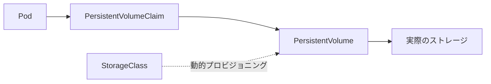

# フェーズ3：設定・ストレージ・セキュリティ・スケジューリング（実技手順）

このフェーズでは、本番運用に必要な詳細設定・セキュリティ・リソース管理について学びます。

## 3-1. アプリケーション設定の分離 (ConfigMap / Secret)

### ConfigMap の作成とマウント

```bash
# リテラルからConfigMapを作成（キーと値を明示的に指定する）
kubectl create configmap app-config \
  --from-literal=SERVER_TIMEOUT=30 \
  --from-literal=LOG_LEVEL=info

# 内容確認
kubectl get configmap app-config -o yaml
```

```bash
# Podへのマウント例（環境変数としての注入）
cat <<EOF > pod-configmap.yaml
apiVersion: v1
kind: Pod
metadata:
  name: pod-with-config
spec:
  containers:
  - name: app
    image: busybox
    command: ["sh", "-c", "echo SERVER_TIMEOUT=\$SERVER_TIMEOUT; echo LOG_LEVEL=\$LOG_LEVEL; sleep 3600"]
    env:
    - name: SERVER_TIMEOUT
      valueFrom:
        configMapKeyRef:
          name: app-config
          key: SERVER_TIMEOUT
    - name: LOG_LEVEL
      valueFrom:
        configMapKeyRef:
          name: app-config
          key: LOG_LEVEL
EOF
kubectl apply -f pod-configmap.yaml
kubectl logs pod-with-config
```

```bash
# ファイルからConfigMapを作成し、ボリュームとしてマウントする例
cat <<EOF > app.conf
timeout=30
max_connections=100
EOF
kubectl create configmap file-config --from-file=app.conf

cat <<EOF > pod-configmap-vol.yaml
apiVersion: v1
kind: Pod
metadata:
  name: pod-with-config-vol
spec:
  containers:
  - name: app
    image: busybox
    command: ["sh", "-c", "cat /etc/config/app.conf; sleep 3600"]
    volumeMounts:
    - name: config-vol
      mountPath: /etc/config
  volumes:
  - name: config-vol
    configMap:
      name: file-config
EOF
kubectl apply -f pod-configmap-vol.yaml
kubectl logs pod-with-config-vol
```

### Secret の作成 (Base64エンコードの注意点)

:::warning SecretはBase64エンコードであり暗号化ではない
`kubectl get secret -o yaml` で確認すると、値はBase64でエンコードされているだけです。etcdへの保存時に暗号化するには別途 `EncryptionConfiguration` の設定が必要です。
:::

```bash
# リテラルからSecretを作成
kubectl create secret generic db-pass --from-literal=password=P@ssw0rd

# 値がBase64エンコードされているだけであることを確認
kubectl get secret db-pass -o jsonpath='{.data.password}'

# デコードして元の値を確認
kubectl get secret db-pass -o jsonpath='{.data.password}' | base64 --decode
echo  # 改行を追加
```

---

## 3-2. データ永続化 (Storage)



### PVとPVCの作成（静的プロビジョニング）

```bash
# PVの作成（管理者がストレージを事前に定義する）
cat <<EOF > pv.yaml
apiVersion: v1
kind: PersistentVolume
metadata:
  name: local-pv
spec:
  capacity:
    storage: 1Gi
  accessModes:
    - ReadWriteOnce
  persistentVolumeReclaimPolicy: Retain
  hostPath:
    path: "/mnt/data"
EOF
kubectl apply -f pv.yaml

# PVCの作成（ユーザーがストレージを要求する）
cat <<EOF > pvc.yaml
apiVersion: v1
kind: PersistentVolumeClaim
metadata:
  name: local-pvc
spec:
  accessModes:
    - ReadWriteOnce
  resources:
    requests:
      storage: 1Gi
EOF
kubectl apply -f pvc.yaml

# PVCがBound状態になったことを確認
kubectl get pvc local-pvc
kubectl get pv local-pv
```

### PVCのPodへのマウントとデータ永続性の確認

```bash
cat <<EOF > pod-pvc.yaml
apiVersion: v1
kind: Pod
metadata:
  name: pod-with-storage
spec:
  containers:
  - name: app
    image: busybox
    command: ["sh", "-c", "echo 'persistent data' > /data/test.txt; sleep 3600"]
    volumeMounts:
    - name: storage
      mountPath: /data
  volumes:
  - name: storage
    persistentVolumeClaim:
      claimName: local-pvc
EOF
kubectl apply -f pod-pvc.yaml

# データの書き込みを確認
kubectl exec pod-with-storage -- cat /data/test.txt

# Podを削除して再作成し、データが残っていることを確認
kubectl delete pod pod-with-storage
kubectl apply -f pod-pvc.yaml
kubectl exec pod-with-storage -- cat /data/test.txt
```

### StorageClass と動的プロビジョニング
StorageClassを使用すると、PVCの作成時にPVが自動的に作成されます（Dynamic Provisioning）。

```bash
# クラスタで利用可能なStorageClassを確認
# PROVISIONER列でどのドライバーが使われるかを確認する
kubectl get storageclass

# デフォルトのStorageClass（(default)付き）が設定されている場合、
# PVCの storageClassName を省略するだけで自動プロビジョニングが動作する
```

---

## 3-3. セキュリティとアクセス制御 (RBAC)

RBACは「**誰が（Subject）**・**何のリソースに（Resource）**・**何をできるか（Verb）**」の3要素で権限を定義します。

### Role と RoleBinding の作成

```bash
# 特定のNamespace内でPodの閲覧のみ許可するRole
kubectl create role pod-reader \
  --verb=get,list,watch \
  --resource=pods \
  -n default

# 内容確認
kubectl describe role pod-reader -n default

# ユーザー "jane" にRoleを紐付け
kubectl create rolebinding read-pods \
  --role=pod-reader \
  --user=jane \
  -n default

# 権限の確認（ユーザーが実際に何をできるかを検証）
kubectl auth can-i list pods --as=jane
kubectl auth can-i delete pods --as=jane   # → "no" になるはず
```

### ServiceAccountを使ったRBAC
PodがKubernetes APIにアクセスする際のIDとしてServiceAccountを使用します。

```bash
# ServiceAccountの作成
kubectl create serviceaccount app-sa

# ServiceAccountにpod-reader Roleを紐付け
kubectl create rolebinding sa-read-pods \
  --role=pod-reader \
  --serviceaccount=default:app-sa \
  -n default

# ServiceAccountを使うPodを作成して権限を確認
cat <<EOF > pod-sa.yaml
apiVersion: v1
kind: Pod
metadata:
  name: pod-with-sa
spec:
  serviceAccountName: app-sa
  containers:
  - name: app
    image: bitnami/kubectl:latest
    command: ["sleep", "3600"]
EOF
kubectl apply -f pod-sa.yaml

# Pod内からkubernetes APIへのアクセスを確認
kubectl exec pod-with-sa -- kubectl get pods         # → 成功する
kubectl exec pod-with-sa -- kubectl get secrets      # → エラー（権限なし）

# ServiceAccountとして権限を確認
kubectl auth can-i list pods --as=system:serviceaccount:default:app-sa
```

---

## 3-4. リソース管理 (ResourceQuota / LimitRange)

### ResourceQuota（Namespace全体のリソース上限）

```bash
# dev-team Namespaceへのリソース制限
cat <<EOF > resourcequota.yaml
apiVersion: v1
kind: ResourceQuota
metadata:
  name: dev-quota
  namespace: dev-team
spec:
  hard:
    requests.cpu: "2"
    requests.memory: 4Gi
    limits.cpu: "4"
    limits.memory: 8Gi
    count/pods: "10"
EOF
kubectl apply -f resourcequota.yaml

# Quotaの使用状況確認（USED / HARD の対比で確認）
kubectl describe resourcequota dev-quota -n dev-team
```

### LimitRange（Pod/Containerごとのデフォルト値と上下限）

```bash
cat <<EOF > limitrange.yaml
apiVersion: v1
kind: LimitRange
metadata:
  name: dev-limits
  namespace: dev-team
spec:
  limits:
  - type: Container
    default:           # requests/limitsの記載がないContainerに自動適用される
      cpu: "500m"
      memory: 256Mi
    defaultRequest:
      cpu: "200m"
      memory: 128Mi
    max:               # 上限（これを超えるPodは作成不可）
      cpu: "2"
      memory: 2Gi
    min:               # 下限（これを下回るPodは作成不可）
      cpu: "100m"
      memory: 64Mi
EOF
kubectl apply -f limitrange.yaml

kubectl describe limitrange dev-limits -n dev-team
```

---

## 3-5. ネットワークセキュリティ (NetworkPolicy)

:::caution
NetworkPolicyの施行はCNIプラグインが担当します。**Calico** など対応したCNIが必要です。Flannelのみでは効果がありません。
:::

デフォルトのKubernetesはNamespace間も含めた全Pod間通信を許可します（default-allow）。

### Default Deny（全インバウンドを拒否）

```bash
cat <<EOF > default-deny.yaml
apiVersion: networking.k8s.io/v1
kind: NetworkPolicy
metadata:
  name: default-deny-ingress
  namespace: default
spec:
  podSelector: {}    # 全Podに適用
  policyTypes:
  - Ingress
EOF
kubectl apply -f default-deny.yaml

# 疎通が遮断されたことを確認（タイムアウトになる）
kubectl run tester --image=busybox --restart=Never -it --rm -- \
  wget -qO- --timeout=3 http://web-service
# → wget: download timed out
```

### ホワイトリスト追加（特定Podからの通信のみ許可）

```bash
cat <<EOF > allow-from-frontend.yaml
apiVersion: networking.k8s.io/v1
kind: NetworkPolicy
metadata:
  name: allow-frontend
  namespace: default
spec:
  podSelector:
    matchLabels:
      app: web               # web Podへのアクセスを制御対象に指定
  policyTypes:
  - Ingress
  ingress:
  - from:
    - podSelector:
        matchLabels:
          role: frontend     # role=frontend のPodからの通信のみ許可
    ports:
    - protocol: TCP
      port: 80
EOF
kubectl apply -f allow-from-frontend.yaml

# 許可されたPodからはアクセスできることを確認
kubectl run allowed-pod --image=busybox --labels="role=frontend" \
  --restart=Never -it --rm -- wget -qO- --timeout=3 http://web-service

# 許可されていないPodからはブロックされることを確認
kubectl run blocked-pod --image=busybox \
  --restart=Never -it --rm -- wget -qO- --timeout=3 http://web-service
# → タイムアウト
```

---

## 3-6. Podスケジューリングの制御

### nodeSelector（特定ラベルのNodeにのみ配置）

```bash
# Nodeにラベルを付与
kubectl label node node1 disktype=ssd

# nodeSelectorで配置Nodeを指定
cat <<EOF > pod-nodeselector.yaml
apiVersion: v1
kind: Pod
metadata:
  name: pod-on-ssd
spec:
  nodeSelector:
    disktype: ssd
  containers:
  - name: nginx
    image: nginx:alpine
EOF
kubectl apply -f pod-nodeselector.yaml

# 指定したNodeに配置されていることを確認
kubectl get pod pod-on-ssd -o wide
```

### Taint と Toleration
NodeにTaint（汚染）を付与すると、そのTaintを許容する `Toleration` を持つPodしかスケジュールされなくなります。

```bash
# ノードにTaintを付与（GPU専用ノード化の例）
kubectl taint nodes node1 gpu=true:NoSchedule

# Tolerationを持たないPodはスケジュールされない（Pending になる）
kubectl run no-toleration --image=nginx
kubectl get pod no-toleration -o wide  # → Pending

# PodにTolerationを付与してスケジュール可能にする
cat <<EOF > pod-toleration.yaml
apiVersion: v1
kind: Pod
metadata:
  name: pod-on-special-node
spec:
  tolerations:
  - key: "gpu"
    operator: "Equal"
    value: "true"
    effect: "NoSchedule"
  containers:
  - name: nginx
    image: nginx
EOF
kubectl apply -f pod-toleration.yaml
kubectl get pod pod-on-special-node -o wide   # → node1 に配置される

# Taintの削除（末尾に "-" を付ける）
kubectl taint nodes node1 gpu=true:NoSchedule-
```

### NodeAffinity
`nodeSelector` より表現力が高く、ハード（必須）とソフト（優先）を使い分けられます。

```bash
cat <<EOF > pod-affinity.yaml
apiVersion: v1
kind: Pod
metadata:
  name: pod-with-affinity
spec:
  affinity:
    nodeAffinity:
      requiredDuringSchedulingIgnoredDuringExecution:   # ハード: 必ずこのNodeに配置
        nodeSelectorTerms:
        - matchExpressions:
          - key: disktype
            operator: In
            values:
            - ssd
      preferredDuringSchedulingIgnoredDuringExecution:  # ソフト: できればこのNodeを優先
      - weight: 1
        preference:
          matchExpressions:
          - key: zone
            operator: In
            values:
            - us-east-1a
  containers:
  - name: nginx
    image: nginx:alpine
EOF
kubectl apply -f pod-affinity.yaml
kubectl get pod pod-with-affinity -o wide
```
