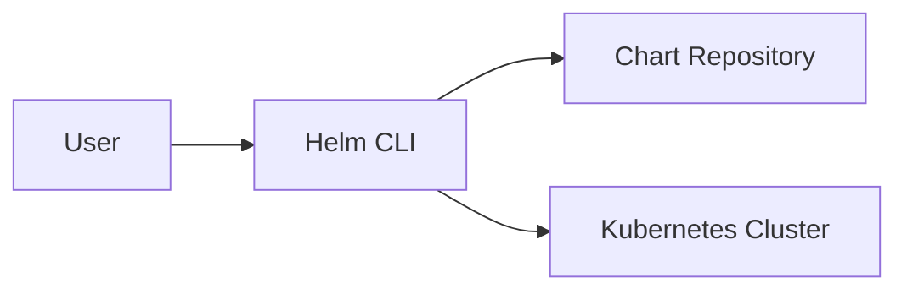
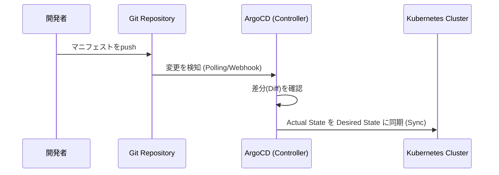
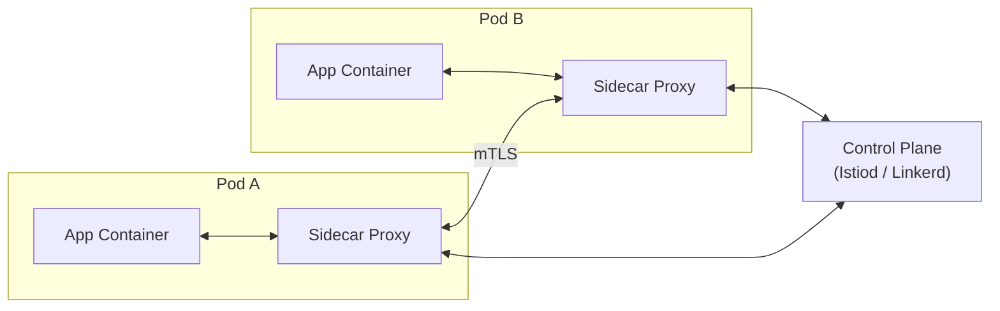

# フェーズ4：クラウドネイティブ・エコシステムの体験（実技手順）

このフェーズでは、Kubernetes本体以外の主要なCNCFプロジェクトを操作し、エコシステム全体の役割を体感します。

## 4-1. コンテナイメージのビルドとレジストリ

アプリケーション配信の出発点は、コンテナイメージの作成とレジストリへの保存です。

### Dockerfileによるイメージビルド

```bash
# サンプルアプリとDockerfileの作成
mkdir myapp && cd myapp
echo '<h1>Hello from KCNA Study!</h1>' > index.html

cat <<EOF > Dockerfile
FROM nginx:alpine
COPY index.html /usr/share/nginx/html/index.html
EXPOSE 80
EOF

# イメージのビルド
docker build -t myapp:v1.0 .

# ローカルイメージの確認
docker images myapp
```

### タグとダイジェスト

```bash
# タグ付け（レジストリへのpush用）
docker tag myapp:v1.0 ghcr.io/<your-username>/myapp:v1.0

# ダイジェストの確認（コンテンツのハッシュ値。タグは変更可能だがダイジェストは不変）
docker inspect --format='{{index .RepoDigests 0}}' myapp:v1.0
```

### コンテナレジストリへのpush/pull

```bash
# GitHub Container Registry へのログインとpush
echo $GITHUB_TOKEN | docker login ghcr.io -u <your-username> --password-stdin
docker push ghcr.io/<your-username>/myapp:v1.0
```

### プライベートレジストリからのpull（imagePullSecret）

```bash
# レジストリ認証情報をSecretとして登録
kubectl create secret docker-registry regcred \
  --docker-server=ghcr.io \
  --docker-username=<your-username> \
  --docker-password=<github-token>

# PodマニフェストでimagePullSecretを参照
cat <<EOF > pod-private.yaml
apiVersion: v1
kind: Pod
metadata:
  name: private-image-pod
spec:
  imagePullSecrets:
  - name: regcred
  containers:
  - name: app
    image: ghcr.io/<your-username>/myapp:v1.0
EOF
kubectl apply -f pod-private.yaml
```

---

## 4-2. パッケージ管理 (Helm)

Helmは、複数のマニフェストを「Chart」としてテンプレート化し、バージョン管理されたパッケージとして配布・管理するツールです。



### Helmの基本操作

```bash
# Helmのインストール (Debian)
curl https://baltocdn.com/helm/signing.asc | sudo gpg --dearmor | sudo tee /usr/share/keyrings/helm.gpg > /dev/null
echo "deb [arch=$(dpkg --print-architecture) signed-by=/usr/share/keyrings/helm.gpg] https://baltocdn.com/helm/stable/debian/ all main" | sudo tee /etc/apt/sources.list.d/helm-stable-debian.list
sudo apt-get update
sudo apt-get install helm

# リポジトリの追加
helm repo add bitnami https://charts.bitnami.com/bitnami
helm repo update

# チャートの検索
helm search repo bitnami/nginx
```

### インストールとカスタマイズ

```bash
# デフォルト設定でインストール
helm install my-nginx bitnami/nginx

# 上書き可能なパラメータを確認
helm show values bitnami/nginx | head -50

# パラメータを上書きしてインストール（--set または -f values.yaml）
helm install my-redis bitnami/redis \
  --set auth.enabled=false \
  --set replica.replicaCount=1

# インストール済みリリースの確認
helm list
```

### リリース管理

```bash
# アップグレード
helm upgrade my-nginx bitnami/nginx --set replicaCount=2

# アップグレード履歴の確認
helm history my-nginx

# ロールバック（リビジョン番号を指定）
helm rollback my-nginx 1

# アンインストール
helm uninstall my-nginx
```

---

## 4-3. 可観測性 (Observability)

システムの内部状態を把握するためのテレメトリの3本柱を体験します。

:::info 可観測性の3本柱
| 種類 | 問いかけ | 代表ツール |
|---|---|---|
| **Metrics（メトリクス）** | 「どのくらい？」— CPUやメモリなど数値の時系列変化 | Prometheus, Grafana |
| **Logs（ログ）** | 「何が起きた？」— イベントやエラーの記録 | Loki, Fluent Bit |
| **Traces（トレース）** | 「どこで遅い？」— リクエストのサービス間伝播の追跡 | Jaeger, OpenTelemetry |
:::

### kubectl によるログ確認（基本）

```bash
# Podのログ確認
kubectl logs <pod-name>

# イベントで障害原因を確認
kubectl describe pod <pod-name>
kubectl get events --sort-by='.lastTimestamp'
```

### Metrics：Prometheus と Grafana のデプロイ

```bash
# kube-prometheus-stack を使用して一括デプロイ
helm repo add prometheus-community https://prometheus-community.github.io/helm-charts
helm repo update
helm install prometheus prometheus-community/kube-prometheus-stack \
  --namespace monitoring --create-namespace

# デプロイ状況の確認
kubectl get pods -n monitoring
```

```bash
# Grafana へのアクセス（Port-forward）
# 実際のService名は環境に応じて確認する
kubectl get svc -n monitoring
kubectl port-forward svc/prometheus-grafana 3000:80 -n monitoring

# ブラウザで http://localhost:3000 にアクセス
# デフォルトのログイン情報: admin / prom-operator
```

### Logs：Loki と Fluent Bit のデプロイ

Loki はログの収集・保存基盤、Fluent Bit は全NodeにDaemonSetとして配置されるログ転送エージェントです。

```bash
# Grafana Loki Stack（Loki + Fluent Bit）のデプロイ
helm repo add grafana https://grafana.github.io/helm-charts
helm repo update
helm install loki grafana/loki-stack \
  --namespace monitoring \
  --set fluent-bit.enabled=true \
  --set grafana.enabled=false    # GrafanaはPrometheusスタック側を使う

# Fluent BitがDaemonSetとして全Nodeに配置されていることを確認
kubectl get daemonset -n monitoring
kubectl get pods -n monitoring -l app.kubernetes.io/name=fluent-bit -o wide
```

```bash
# Grafana にLokiのデータソースを追加
# Grafana UI → Connections → Data Sources → Add data source → Loki
# URL: http://loki:3100
# → Explore でラベルを選択してログを検索できる
```

---

## 4-4. アプリケーションの配信と GitOps (ArgoCD)

GitOpsは、GitをKubernetesクラスタの唯一の情報源（Single Source of Truth）とし、Git上のDesired StateとクラスタのActual Stateを常に同期させるCDアプローチです。



### ArgoCD のインストール

```bash
# Namespace作成とインストール
kubectl create namespace argocd
kubectl apply -n argocd -f https://raw.githubusercontent.com/argoproj/argo-cd/stable/manifests/install.yaml

# 起動を待機
kubectl wait --for=condition=available deployment/argocd-server -n argocd --timeout=120s

# ArgoCD CLI のインストール (Linux)
curl -sSL -o argocd-linux-amd64 https://github.com/argoproj/argo-cd/releases/latest/download/argocd-linux-amd64
sudo install -m 555 argocd-linux-amd64 /usr/local/bin/argocd
rm argocd-linux-amd64

# 初期パスワードの取得
kubectl -n argocd get secret argocd-initial-admin-secret -o jsonpath="{.data.password}" | base64 -d; echo

# ArgoCDへのアクセス（Port-forward）
kubectl port-forward svc/argocd-server 8080:443 -n argocd
# ブラウザで https://localhost:8080 にアクセス
```

### Application の作成（GitリポジトリとKubernetesの同期設定）

```bash
# ArgoCD CLIでログイン
argocd login localhost:8080 --username admin --password <initial-password> --insecure

# Applicationの作成（GitリポジトリのマニフェストをKubernetesに同期）
argocd app create myapp \
  --repo https://github.com/<your-username>/<your-repo>.git \
  --path k8s/ \                           # リポジトリ内のマニフェストが置かれたパス
  --dest-server https://kubernetes.default.svc \
  --dest-namespace default \
  --sync-policy automated                 # 変更を自動で同期する

# Applicationの状態確認
argocd app get myapp
argocd app list
```

### GitOps Self-healing の確認

```bash
# Gitリポジトリを変更せずにkubectlで直接クラスタ状態を変更（乖離を発生させる）
kubectl scale deployment web-deploy --replicas=1

# ArgoCDが OutOfSync を検知し、Gitの定義（Desired State）に自動で戻すことを確認
kubectl get pods -l app=web --watch
argocd app get myapp   # STATUS が Healthy/Synced に戻ることを確認
```

---

## 4-5. サービスメッシュ（概要）

サービスメッシュは、アプリケーションコードを変更せずにサイドカープロキシ経由で通信制御・可観測性・mTLS（相互TLS）を実現する仕組みです。KCNA-JPでは概念の理解が問われるため、全体像の把握を優先します。



### Linkerd のインストール

```bash
# Linkerd CLI のインストール
curl --proto '=https' --tlsv1.2 -sSfL https://run.linkerd.io/install | sh
export PATH=$PATH:$HOME/.linkerd2/bin

# インストール前の環境チェック
linkerd check --pre

# CRDのインストール（v2.12以降は --crds を先に適用する必要がある）
linkerd install --crds | kubectl apply -f -

# コントロールプレーンのインストール
linkerd install | kubectl apply -f -

# インストールの確認
linkerd check
```

```bash
# 既存アプリへのサイドカー注入（Namespace単位で自動注入を有効化）
kubectl annotate namespace default linkerd.io/inject=enabled

# Podを再起動してサイドカーを注入
kubectl rollout restart deployment/web-deploy

# サイドカーが注入されていることを確認（READY列が 2/2 になる）
kubectl get pods -l app=web

# ダッシュボードでトラフィックの成功率・遅延を確認
linkerd viz install | kubectl apply -f -
linkerd viz dashboard &
```
