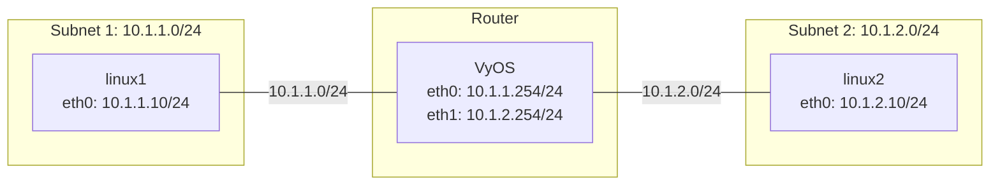

VyOS を使った単純なルーティング
===

## 準備するもの

### 実行環境

実機を用意するのは大変なので仮想マシンでも実行可能です。  
ここでは下記の環境で動作確認を行っています。  
仮想マシンを動かす PC には、16 GB以上メモリがあると安心です。

| 項目     | 内容                                |
| :------- | :---------------------------------- |
| 仮想環境 | VMware Workstation Pro 25H2         |
| VM       | vCPU 1、メモリ 2GB、ストレージ 8 GB |
| OS       | ルータ：vyos-2026.06.20-0050-rolling-generic-amd64 <br />その他：Debian Linux 13 最小インストール    |

### Linux にインストールしておくもの

SSH サーバ／クライアントと ping が必要になります。  
su コマンドで root ユーザに昇格し下記のパッケージをインストールしておいてください。

```bash
apt update
apt install ssh inetutils-ping
# 最小インストールの debian には sudo コマンドが無いので、
# インストールしておくと他の Linux 同じに使用できて便利です。
apt install sudo
# sudo グループに debian アカウントを追加します。
# debian アカウントはインストールした環境に合わせて適宜修正してください。
# sudo グループの設定は、再ログイン後に反映されます。
/sbin/usermod -aG sudo debian
```

### VMware 仮想ネットワークの構成


---

## 構成図



## 前提条件

- エンドノード (linux1, linux2) のOS: Debian Linux
- ルーターのOS: VyOS
- 各Linuxノードのファイアウォール（iptables/nftables等）はパケットを破棄しない（ACCEPT）状態であること。
- インターフェース名（`eth0`, `eth1`）は環境に合わせて適宜読み替えてください。

## 構築手順

### 1. VyOS の設定

VyOSで各インターフェースにIPアドレスを設定します。VyOSではIPアドレスが設定されたインターフェース間のルーティング（フォワーディング）はデフォルトで有効になります。

```text
# 設定モードに入る
configure

# インターフェースにIPアドレスを設定
# VMnet11
set interfaces ethernet eth0 address '10.1.1.254/24'
# VMnet12
set interfaces ethernet eth1 address '10.1.2.254/24'

# 設定を適用して保存
commit
save

# 設定モードを抜ける
exit
```

### 2. linux1 の設定

subnet1に所属するDebian Linuxの設定です。IPアドレスの設定と、subnet2宛てのスタティックルートを追加します。

```bash
# IPアドレスの設定とリンクアップ
sudo ip addr add 10.1.1.10/24 dev eth0
sudo ip link set eth0 up

# subnet2 (10.1.2.0/24) 宛てのスタティックルートをVyOS (10.1.1.254) 経由で登録
sudo ip route add 10.1.2.0/24 via 10.1.1.254
```

### 3. linux2 の設定

subnet2に所属するDebian Linuxの設定です。IPアドレスの設定と、subnet1宛てのスタティックルートを追加します。

```bash
# IPアドレスの設定とリンクアップ
sudo ip addr add 10.1.2.10/24 dev eth0
sudo ip link set eth0 up

# subnet1 (10.1.1.0/24) 宛てのスタティックルートをVyOS (10.1.2.254) 経由で登録
sudo ip route add 10.1.1.0/24 via 10.1.2.254
```

---

## 疎通確認手順

### ルーティングテーブルの確認

各Linuxノードで正しくルートが登録されているか確認します。

```bash
# ルーティングテーブルの表示
ip route
```

**linux1の期待される出力例:**
```text
10.1.1.0/24 dev eth0 proto kernel scope link src 10.1.1.10 
10.1.2.0/24 via 10.1.1.254 dev eth0 
```

VyOS上でも正しくConnectedルートが認識されているか確認できます。
```text
# VyOSでのルーティングテーブルの表示
show ip route
```

### pingによる疎通確認

**linux1 から linux2 への通信確認:**
```bash
ping -c 4 10.1.2.10
```

**linux2 から linux1 への通信確認:**
```bash
ping -c 4 10.1.1.10
```

パケットロスがなく応答が返ってくれば、ルーティングが正しく機能しています。

### 疎通できなくなることの確認

Linux1 と Linux2 のルーティングテーブルから互いのネットワークへのルートを削除すると通信ができなくなります。

```bash
# Linux1 で実行
sudo ip route del 10.1.2.0/24
# Linux2 で実行
sudo ip route del 10.1.1.0/24
```

:::note ルーティングテーブル削除時の注意
ルータ役の Linux 経由で Linux1、Linux2 に SSH でログインしている場合で、リモートではなくローカルのネットワークへのルートを削除した場合、それ以降、SSH 経由での操作ができなくなるので注意が必要です。
:::
