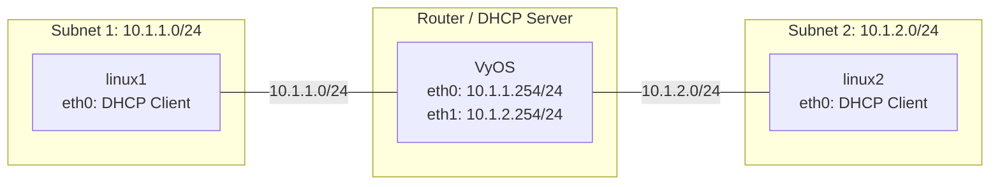

VyOS の DHCP サーバーを利用したルーティング構成
===

## 準備するもの

### 実行環境

[VyOSを使った単純なルーティング](./02_simple_vyos_static.md) と同じ構成を使用します。

### VyOS のインストール

VyOS を iso イメージから起動し下記のコマンドからインストールします。

```bash
install image
```

VyOS が iso イメージから起動しているのか、ストレージから起動しているのかの確認は

```bash
show system image
```

で確認できます。

### VMware ホストからの SSH 接続

```bash
# VMware ホストから DHCP で IP アドレスを取得する
set interfaces ethernet eth0 address dhcp
# SSH サーバの有効化
set service ssh
```

---


## 構成図



## 前提条件

- エンドノード (linux1, linux2) のOS: Debian Linux
- ルーターのOS: VyOS
- 各Linuxノードのインターフェースは手動のIPアドレス設定が行われておらず、DHCPクライアントとして動作できる状態であること。
- インターフェース名（`eth0`, `eth1`）は環境に合わせて適宜読み替えてください。

## 構築手順

### 1. VyOS の設定 (インターフェースとDHCP)

VyOSにIPアドレスを設定し、各サブネット向けのDHCPサーバー機能を有効化します。これにより、クライアントにIPアドレスと他方サブネットへの静的ルートが配布されます。

```text
# 設定モードに入る
configure

# インターフェースにIPアドレスを設定
set interfaces ethernet eth0 address '10.1.1.254/24'
set interfaces ethernet eth1 address '10.1.2.254/24'

# subnet1向けのDHCPサーバー設定
set service dhcp-server shared-network-name SUBNET1 subnet 10.1.1.0/24 subnet-id 1
set service dhcp-server shared-network-name SUBNET1 subnet 10.1.1.0/24 range 0 start 10.1.1.100
set service dhcp-server shared-network-name SUBNET1 subnet 10.1.1.0/24 range 0 stop 10.1.1.200
set service dhcp-server shared-network-name SUBNET1 subnet 10.1.1.0/24 option static-route 10.1.2.0/24 next-hop 10.1.1.254

# subnet2向けのDHCPサーバー設定
set service dhcp-server shared-network-name SUBNET2 subnet 10.1.2.0/24 subnet-id 2
set service dhcp-server shared-network-name SUBNET2 subnet 10.1.2.0/24 range 0 start 10.1.2.100
set service dhcp-server shared-network-name SUBNET2 subnet 10.1.2.0/24 range 0 stop 10.1.2.200
set service dhcp-server shared-network-name SUBNET2 subnet 10.1.2.0/24 option static-route 10.1.1.0/24 next-hop 10.1.2.254

# 設定を適用して保存
commit
save

# 設定モードを抜ける
exit
```

### 2. linux1 の設定 (DHCPの取得)

subnet1に所属するDebian LinuxでDHCPクライアントを実行し、IPアドレスとルート情報を取得します。

```bash
# インターフェースを起動
sudo ip link set eth0 up

# DHCPでIPアドレスとルート情報を取得
sudo dhclient eth0
```

### 3. linux2 の設定 (DHCPの取得)

subnet2に所属するDebian Linuxでも同様にDHCPクライアントを実行します。

```bash
# インターフェースを起動
sudo ip link set eth0 up

# DHCPでIPアドレスとルート情報を取得
sudo dhclient eth0
```

## 疎通確認手順

### IPアドレスとルーティングテーブルの確認

各Linuxノードで、DHCPから正しくIPアドレスとデフォルトルートが割り当てられているか確認します。

```bash
# 割り当てられたIPアドレスの確認 (例としてlinux1では 10.1.1.100 等になります)
ip addr show dev eth0

# ルーティングテーブルの確認
ip route
```

**linux1の期待されるルーティングテーブル出力例:**
```text
10.1.1.0/24 dev eth0 proto kernel scope link src 10.1.1.100 
10.1.2.0/24 via 10.1.1.254 dev eth0 
```
デフォルトルートは設定されず、他方のサブネット（`10.1.2.0/24`）への静的ルートがDHCPから配布され、VyOSを経由して通信が可能になります。

### pingによる疎通確認

確認したIPアドレスを用いて、互いにpingで疎通確認を行います。
（※ここでは、DHCPにより `linux1` が `10.1.1.100`、`linux2` が `10.1.2.100` を取得したと仮定します）

**linux1 から linux2 への通信確認:**
```bash
ping -c 4 10.1.2.100
```

**linux2 から linux1 への通信確認:**
```bash
ping -c 4 10.1.1.100
```

VyOS側でも、DHCPのリース状況を確認できます。
```text
# VyOSでのDHCPリース状況の確認
show dhcp server leases
```
